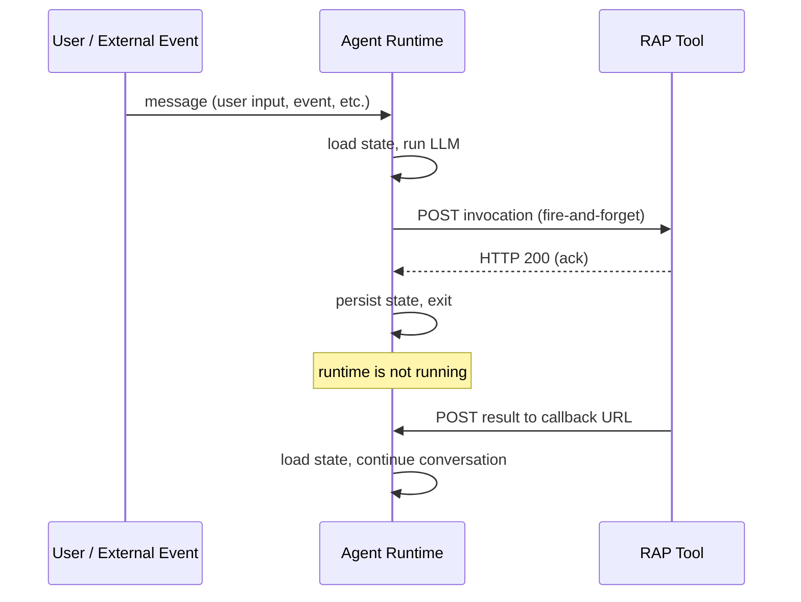

# Architecture

RAP is a message-passing protocol between two roles: an agent runtime and a set of tools. The runtime invokes tools via HTTP. Tools return results asynchronously by POSTing to a callback URL provided in the invocation. Between tool calls, the runtime shuts down entirely.

Every input the runtime processes — user messages, tool results, subscription events — arrives through the same channel. The runtime doesn't distinguish between "waking from a tool call" and "receiving new user input." It loads state and processes whatever's there.

## Hibernation

This is the defining property of RAP. After dispatching a tool call, the runtime persists conversation state and shuts down. The process exits. Zero compute is consumed until the next message arrives.

This isn't a special sleep mode — it's how every tool call works. The runtime fires the request, the tool acknowledges, and the runtime is done. When the tool eventually finishes (milliseconds or days later), it POSTs the result to the callback URL, and the runtime starts fresh.

An agent waiting for a 3-day CI pipeline costs exactly the same as one that was never created. Cost is proportional to work done, not time elapsed. This is what lets RAP agents run indefinitely — an agent monitoring GitHub PRs, reacting to Slack messages, and tracking stock prices can stay alive for months, waking only when something happens.

## The two roles

**Agent Runtime.** The process that orchestrates LLM completions and tool dispatch. It's stateless and ephemeral — starts when a message arrives, loads conversation history from durable storage, runs the LLM, dispatches tool calls, persists state, and exits. Can be a Lambda function, a container, a CLI process — anything that speaks the RAP message format.

**Tool.** An independent HTTP service. It receives invocations, acknowledges immediately, processes asynchronously, and POSTs results to the callback URL. Tools have their own lifecycle, scaling, and failure characteristics. They know nothing about the agent's LLM or conversation state.

## MCP compatibility

MCP servers work as RAP tools through a proxy layer. The proxy wraps an MCP server process, translates between JSON-RPC and RAP's HTTP contract, and returns results asynchronously. From the runtime's perspective, an MCP tool looks like any other RAP tool — invoked via HTTP, results arrive through the callback.

This means you get the full MCP ecosystem while gaining RAP's async execution for the tools that need it. See [MCP Compatibility](/docs/about/mcp-compatibility) for details on how the proxy layer works.
