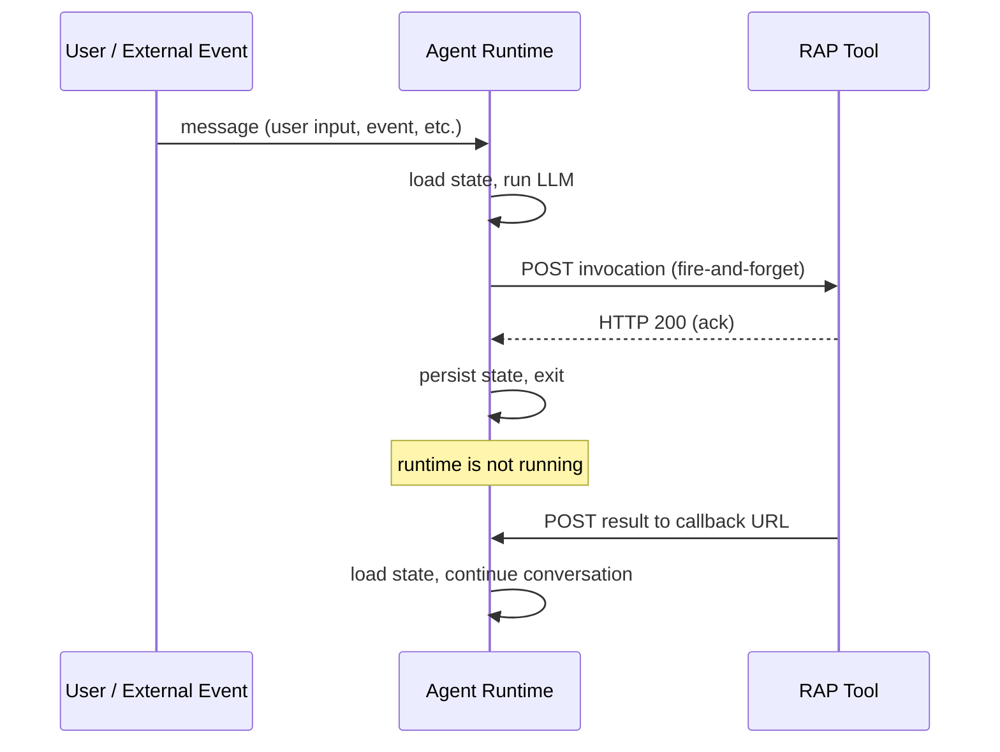

# Architecture

RAP is a message-passing protocol between two roles: an agent runtime and a set of RAP servers. The runtime calls RAP tools over HTTP, and tools return results asynchronously by POSTing to a callback URL. Between messages, the runtime shuts down.

The **agent runtime** orchestrates LLM completions and tool dispatch. It's stateless and ephemeral: start, load conversation history from storage, run the LLM, dispatch tool calls, persist state, exit. It can be a Lambda function, a container, a CLI process, anything that speaks the RAP message format. See [Agent Runtime](/docs/about/agent-runtime) for the full design.

A **RAP server** is an independent HTTP service. It receives invocations, acknowledges immediately, processes asynchronously, and POSTs results to the callback URL. Tools have their own lifecycle, scaling, and failure modes. They know nothing about the agent's LLM or conversation state. See [RAP Servers](/docs/about/rap-servers) for how invocations and results work.

## Hibernation

After dispatching a tool call, the runtime persists conversation state and exits. Nothing runs until the next message arrives.

This is possible because RAP has no long-lived connections between the runtime and its tools. MCP ties the runtime to each tool through a persistent channel (a stdio pipe or an HTTP session). The runtime has to stay alive to hold those connections open, even when it's just waiting for a response. RAP replaces that with stateless HTTP: the runtime POSTs an invocation, the tool acknowledges, and both sides are free to go. The tool delivers its result later by POSTing to the callback URL. No connection needs to be maintained in between.

Because there's nothing to keep alive, the runtime can exit after every tool dispatch. An agent waiting for a 3-day CI pipeline costs exactly the same as one that was never created. Cost is proportional to work done, not time elapsed. An agent monitoring GitHub PRs, reacting to Slack messages, and tracking stock prices can stay alive for months, waking only when something happens.

The runtime also provides explicit sleep tools (`sleep`, `sleep_until`, `sleep_until_event_or_input`) that schedule future wake-ups or wait for external events. These build on the same hibernation mechanism. See [Built-in Tools](/docs/infinity-runtime/built-in-tools) for details.

## Subscriptions

Tools can register ongoing subscriptions that deliver events over time. A GitHub webhook listener, a stock price monitor, a Slack channel watcher: these tools send `subscription_event` messages to the callback URL whenever something happens. Each event wakes the agent.

The runtime handles subscription events using synthetic tool calls, which present each event to the LLM as a natural tool call/result pair in conversation history. Events are processed in isolated child threads to keep the parent context clean. See [Subscriptions](/docs/about/subscription-events) for the full design.

## Threading

Agents can spawn child threads for parallel work. Each thread runs independently with its own context window and message stream. Children inherit the parent's conversation history up to the spawn point, process their task, and report results back.

Threading is how the runtime handles concurrent work (review multiple files in parallel), context isolation (process a subscription event without polluting the main conversation), and divide-and-conquer patterns. See [Threading](/docs/infinity-runtime/threading) for how threads are spawned, how they communicate, and how subscription events are routed.

## MCP compatibility

MCP servers work as RAP tools through a proxy layer. The proxy wraps an MCP server, translates between JSON-RPC and RAP's HTTP contract, and returns results asynchronously. From the runtime's perspective, an MCP tool looks like any other RAP tool: invoked via HTTP, results arrive through the callback.

You get the full MCP ecosystem while gaining async execution for the tools that need it. See [MCP Compatibility](/docs/about/mcp-compatibility) for how the proxy works, including stdio and HTTP transport modes, session continuity, and OAuth.
