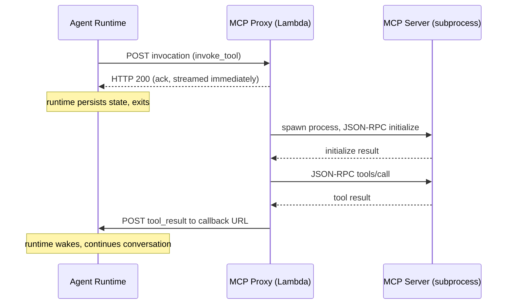
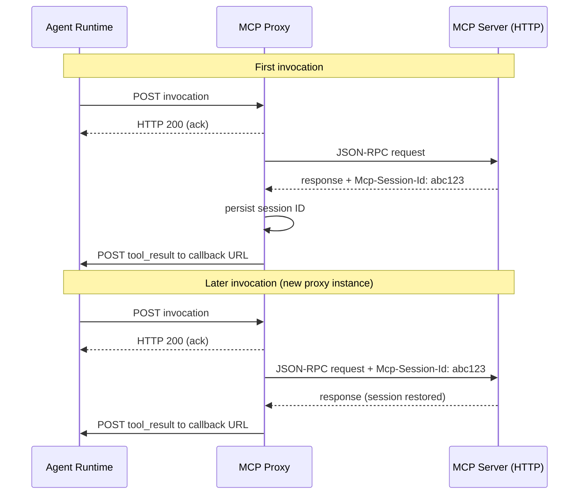

# MCP Compatibility

RAP is designed to coexist with MCP, not replace it. Any MCP server can be used as a RAP tool through a proxy layer that translates between MCP's synchronous JSON-RPC protocol and RAP's async HTTP contract. From the LLM's perspective, MCP tools and native RAP tools are indistinguishable.

## How the proxy works

The proxy sits between the agent runtime and the MCP server. It exposes a standard RAP toolset interface (`/.well-known/rap-toolset`) and translates invocations into MCP JSON-RPC calls internally. Two wrapper tools are generated for each MCP server: `list_tools` (discover available tools) and `invoke_tool` (call a specific tool by name with arguments).

When the agent invokes an MCP tool, the proxy acknowledges immediately — just like any RAP tool — then spawns the MCP server, sends the JSON-RPC request, waits for the synchronous response, and POSTs the result back to the agent's callback URL.



This turns a synchronous MCP call into an asynchronous RAP call. An MCP tool that takes 30 seconds to respond no longer blocks the agent for 30 seconds — the runtime hibernates at zero cost and resumes when the result arrives.

## MCP Transport Modes

The proxy supports two ways of connecting to MCP servers, depending on how the server is deployed.

### Stdio (subprocess)

For MCP servers distributed as CLI tools (the most common pattern), the proxy spawns the server as a child process and communicates over stdin/stdout using MCP's JSON-RPC protocol. The server is started fresh for each invocation and terminated afterward.

This is the mode used by `LambdaMCPToolSet` in the Infinity Agent CDK. You provide the command to run the server, and the proxy handles the rest:

```typescript
new LambdaMCPToolSet(this, 'GitHub', {
  name: 'github',
  command: ['npx', '-y', '@modelcontextprotocol/server-github'],
  env: { GITHUB_PERSONAL_ACCESS_TOKEN: process.env.GITHUB_TOKEN },
});
```

The proxy pre-installs npm packages during Lambda cold start to avoid repeated downloads.

### Streamable HTTP

For MCP servers deployed as HTTP endpoints, the proxy connects using MCP's Streamable HTTP transport. It sends JSON-RPC requests as HTTP POSTs and handles both direct JSON responses and SSE (Server-Sent Events) streaming responses.

This is the mode used by `HTTPMCPToolSet`:

```typescript
new HTTPMCPToolSet(this, 'RemoteServer', {
  name: 'remote',
  url: 'https://mcp-server.example.com/mcp',
  headers: { 'X-API-Key': 'your-key' },
});
```

## Stateful Session Continuity

MCP includes a session mechanism (`Mcp-Session-Id` header) that allows clients to resume sessions with a server. The proxy uses this to bridge MCP's session model with RAP's ephemeral execution.



When an MCP server returns a session ID, the proxy stores it. On subsequent invocations, the proxy includes the stored session ID in the request, allowing the server to restore context. For MCP servers that support this pattern, the proxy can spawn a fresh process on each invocation and still maintain session continuity.

## OAuth support

Some MCP servers require OAuth authorization. The proxy handles the full OAuth 2.0 flow, including:

1. Detecting a `401` response with a `WWW-Authenticate` header pointing to a Protected Resource Metadata document
2. Fetching OAuth metadata (authorization server, token endpoint, scopes)
3. Performing Dynamic Client Registration (RFC 7591) if no client credentials are pre-configured
4. Generating a PKCE challenge and building the authorization URL
5. Sending the authorization URL back to the agent via RAP, so the agent can present it to the user
6. Handling the OAuth callback, exchanging the authorization code for tokens, and storing them in DynamoDB

Once authorized, the proxy includes the access token in subsequent requests to the MCP server. Tokens are stored per-user in a DynamoDB table with TTL-based expiration.

To enable OAuth, pass an `oauth` configuration to `HTTPMCPToolSet`:

```typescript
new HTTPMCPToolSet(this, 'SecureServer', {
  name: 'secure',
  url: 'https://mcp-server.example.com/mcp',
  oauth: {
    callbackGateway: api,
    stageName: 'prod',
    // Optional: pre-configured credentials (skips Dynamic Client Registration)
    clientId: 'your-client-id',
    clientSecret: 'your-client-secret',
  },
});
```

## Stateful MCP servers

Some MCP servers maintain in-memory state across calls — database connections, authentication sessions, cached resources. These servers expect to stay alive for the duration of a conversation.

You can handle this in RAP by keeping the MCP server process running in a long-lived container, with the proxy routing requests to the persistent process. This works, but it undermines RAP's core value: you're back to paying for idle compute, and you lose durability if the process crashes.

The model RAP pushes toward is one where MCP servers externalize their state — to a database, a cache, or a session store — and can be cold-started with a session ID to resume where they left off. This aligns with how modern web services work: stateless processes, externalized state, horizontal scaling. As more MCP servers adopt this pattern, the gap between MCP and RAP narrows, and agents get the best of both ecosystems.
