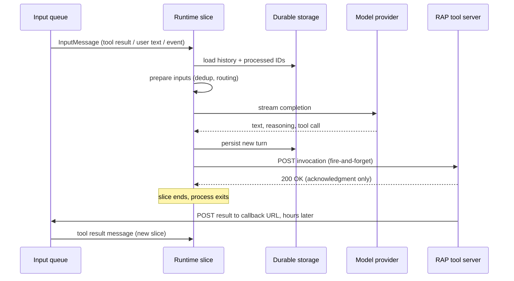
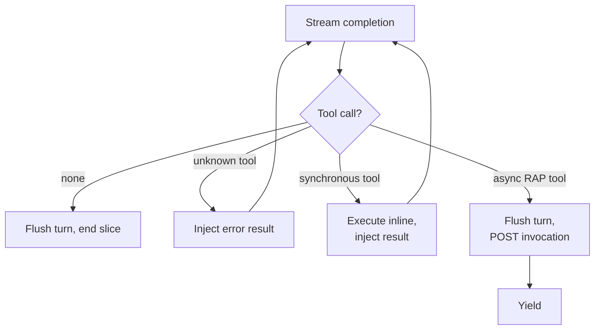
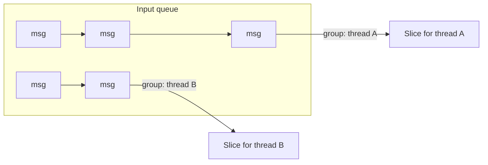
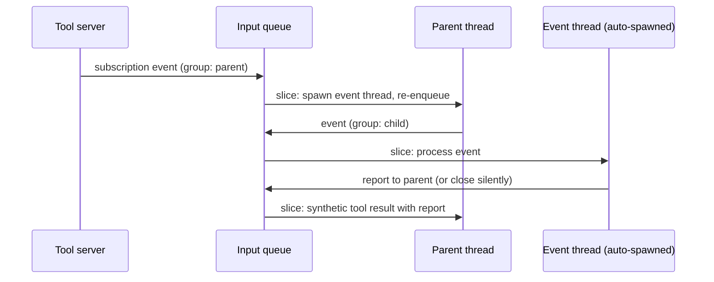

# Architecture

The Infinity Runtime is organized around one invariant: **an execution slice never blocks on anything external**. This page walks through what happens inside a slice, how the runtime yields, and how the surrounding machinery (turn durability, deduplication, message ordering) keeps the whole thing correct on infrastructure that only offers at-least-once delivery.

## Everything is a message

The runtime consumes exactly one kind of input: an `InputMessage` on the input queue. User text, tool results, subscription events, reports from child threads, OAuth challenges, and timer wake-ups are all the same type, distinguished by their content and an optional `synthetic` tag. Each message carries a `group_id` identifying the conversation thread it belongs to.

This uniformity is what lets the runtime shut down completely between slices. There is no in-process state machine tracking "waiting for tool X" or "sleeping until 9am". Whatever the agent is waiting for will eventually show up as a message, and the slice that processes it reconstructs everything it needs from storage.

## Anatomy of a slice

A slice begins when one or more messages arrive for a thread, and ends when the runtime has either dispatched a tool call or finished a completion with no tool call. In between:

The three phases map directly onto the core API:

1. **Load.** `HistoryManager::new_with_history` restores the thread's conversation from the `ConversationStore`, walking the ancestor chain for child threads and substituting compaction summaries where they exist. It also loads the set of already-processed message IDs from the `StateStore`.

2. **Prepare and complete.** `process_batch` runs each input through `prepare_input`, which deduplicates redelivered messages, drops messages for closed threads, routes subscription events (see below), and appends actionable content to history. If any input was actionable, `run_completion` streams a completion from the `ModelProvider`.

3. **Dispatch and yield.** If the model produced a tool call, `execute_action` invokes the matching `Tool` implementation. For RAP tools this is a single HTTP POST containing the arguments and a `callback_url`; the tool server acknowledges and the call returns. The slice persists any remaining state and ends. On Lambda the process exits; in an embedded runtime the worker task goes back to awaiting its channel.

The model's decision to call a tool is what ends the slice. This is the yield point, and it is why the runtime never needs to hold a connection open: the tool result re-enters through the front door as a fresh `InputMessage`, whether it takes 100 milliseconds or three days.

## Synchronous tools loop back

Not every tool should yield. `spawn_thread` completes in microseconds against the conversation store, and yielding for it would waste a full store round trip and risk a race: a concurrent event could arrive between the dispatch and the result, making the call appear cancelled even though it ran.

Tools can therefore opt into synchronous execution by implementing `Tool::execute_synchronous`. When the completion stream encounters a call to such a tool, the runtime executes it inline, injects the result directly into history, and **loops back** into another completion within the same slice instead of yielding:

Unknown tool names take the same loop-back path with an injected error, so a hallucinated tool call costs one extra completion rather than a stuck conversation.

## Turns and durability

Streaming output is buffered in a **turn buffer** and only committed when the turn completes: either the model finishes without a tool call, or a tool call ends the turn. If the stream errors mid-turn, the buffer is discarded and the completion retries, so half-streamed assistant messages never reach storage. When a tool call ends a turn, the runtime flushes the buffer *before* dispatching the invocation, guaranteeing the call is durable in history before its result can possibly arrive.

Durability alone is not enough, because queues redeliver. Every input message and completion carries a stable ID, and the `StateStore` tracks which IDs each thread has already processed. A redelivered message is recognized in `prepare_input` and skipped, making slices effectively idempotent on top of at-least-once delivery.

## Ordering: FIFO per thread, concurrency across threads

Within a single thread, slices must be serialized; two slices loading and writing the same history concurrently would corrupt it. Across threads there is no shared state, so they should run in parallel.

The runtime encodes this directly in the queue: messages are grouped by `group_id`, and the transport guarantees per-group FIFO ordering. On AWS this is an SQS FIFO queue with `MessageGroupId`, where Lambda automatically runs one invocation per active group and scales groups independently. In an embedded runtime it is one `mpsc` channel and worker task per thread.

This is also how [threading](./threading.md) gets its concurrency: spawning a child thread just creates a new message group. Children inherit the parent's history up to the spawn point, run their own slices in parallel, and report back with messages tagged as thread reports, which the parent sees as synthetic tool results.

## Subscription events

RAP [subscriptions](/docs/rap/about/subscription-events) deliver an open-ended stream of events against a single tool call. When an event arrives for a thread, `prepare_input` does not append it to that thread's history. Instead it spawns a temporary child thread seeded with the event and instructions to process it, then re-enqueues the event for the child:

The parent's context stays clean: it sees a report if the event mattered and nothing at all if it didn't. Events marked *associative* skip the child thread and inject inline, for streams where every event belongs in the subscribing thread's own history (such as log lines from a long-running command).

## Compaction

Long-lived agents eventually outgrow the model's context window. When a thread's history approaches the limit (the daemon embedding triggers at roughly three quarters of the model's context window), the runtime spawns a compaction thread that summarizes the conversation and stores the summary in the `ConversationStore`, tagged with the history index it covers. Subsequent slices load the summary plus only the messages after that index. Because summaries are indexed by position, child threads spawned before a compaction still reconstruct the exact history they inherited.

## Why this runs on serverless

Putting the pieces together, the runtime satisfies every constraint a serverless platform imposes, not as an accommodation but as a consequence of its design:

- **Bounded execution time.** A slice is one completion plus some HTTP and storage calls. Nothing in it waits on an unbounded external operation.
- **No process affinity.** All state is in storage keyed by thread ID. Any invocation of the function can process any thread's next message.
- **At-least-once delivery.** Processed-ID tracking makes redelivery harmless.
- **Concurrency control without locks.** FIFO message groups serialize each thread at the queue layer, so the runtime itself needs no distributed locking.

Runtimes that block on tool calls can be *hosted* on serverless platforms only by holding invocations open while tools run, paying for idle wall-clock time and hitting invocation timeouts. The Infinity Runtime is the first agent runtime where serverless is the natural substrate: the platform's own scale-to-zero behavior is the hibernation mechanism.
