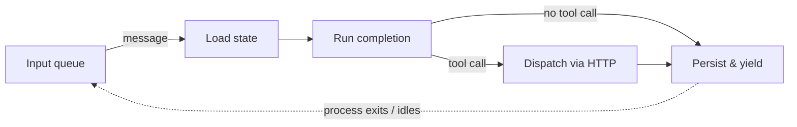

# Infinity Runtime

The Infinity Runtime is the reference runtime for the [Reactive Agent Protocol](/docs/rap/what-is-rap). It is a Rust library, `infinity-agent-core`, that runs agents as a sequence of short **execution slices**: each slice loads conversation state from durable storage, runs one model completion, dispatches any tool call as a fire-and-forget HTTP request, persists state, and yields. Between slices, nothing runs.

This yielding architecture makes Infinity the first agent runtime that runs natively on serverless platforms. A conventional agent runtime holds a process open while it awaits tool results, which rules out platforms like AWS Lambda where invocations are short-lived and billed by the millisecond. Because an Infinity slice never blocks on anything external, every slice fits inside a single serverless invocation, and an agent that is waiting (on a tool result, a webhook, a human, or a three-day CI pipeline) costs exactly nothing.

The cycle repeats when the next message arrives. Tool results, user messages, subscription events, thread reports, and timer wake-ups all enter through the same input queue, so at the execution level the runtime has exactly one job: take the next message for a thread, run a slice, yield.

## Why yielding matters

Under RAP, a tool call is not a request/response round trip. The runtime POSTs the invocation, the tool server acknowledges immediately, and the result arrives later as a new message on the input queue. The runtime treats the completion of a tool call as the end of its work:

1. **Load**: restore conversation history and deduplication state from durable storage, and append the new input message.
2. **Complete**: stream a model completion. Text and reasoning are buffered; a tool call ends the turn.
3. **Dispatch and yield**: fire off the tool call over HTTP, persist the updated history, and stop.

Nothing in this cycle waits. The consequences compound:

- **Hibernation is free.** An agent subscribed to GitHub webhooks can stay "alive" for months while consuming zero compute. Waking up is just processing the next message.
- **Serverless is the natural deployment target.** Each slice is one Lambda invocation. Hundreds of agents share one function, and scale-to-zero is the default rather than an optimization.
- **Agents are durable.** All state lives in storage, not process memory, so agents survive restarts, redeploys, and cold starts by construction.
- **Interruptions are ordinary messages.** If a user sends a message while a tool is still running, the runtime processes it in the next slice. The pending tool result arrives later and is appended to history normally.

The [Architecture](./architecture.md) page walks through the yielding machinery in detail, including how synchronous tools loop back within a slice and how per-thread FIFO ordering keeps concurrent threads safe.

## One core, two ways to run it

`infinity-agent-core` contains the agent loop, history management, tool dispatch, threading, and compaction. It has no dependency on any particular storage, transport, or model backend; those are trait parameters. You run it in one of two ways:

**Deploy it on AWS Lambda.** The `infinity-agent-lambda` crate binds the core to SQS FIFO queues, Aurora DSQL, DynamoDB, and Bedrock, and the included CDK constructs provision the whole stack. This is the production path. See [Deploying on AWS Lambda](./deploying-on-lambda.mdx).

**Embed it through the Rust API.** Implement the core's traits against your own backends (or the in-memory ones) and drive the loop from your own process. The Infinity Code daemon is a full example: it embeds the runtime with in-memory stores, `mpsc` channels instead of SQS, and file-based persistence. See [The Rust API](./rust-api.md).

| | AWS Lambda | Embedded (Rust API) |
|---|---|---|
| Conversation history | Aurora DSQL | Anything implementing `ConversationStore` |
| Dedup & subscription state | DynamoDB | Anything implementing `StateStore` |
| Message delivery | SQS FIFO queue | Anything implementing `InputSender` |
| Yield | Process exits | Task idles on a channel |
| Timers (`sleep`) | SQS delay / EventBridge Scheduler | `tokio::time::sleep` |
| Tool auth | SigV4-signed HTTP | Plain HTTP |

The execution model is identical in both. Code written against the core (tools, providers, tests) runs unchanged in either environment.

## What's in these docs

- **[Architecture](./architecture.md)**: the slice lifecycle, the yielding mechanism, turn durability, and message ordering, with diagrams.
- **[The Rust API](./rust-api.md)**: the crates, the traits, and how to embed the runtime in your own process.
- **[Deploying on AWS Lambda](./deploying-on-lambda.mdx)**: the CDK constructs and the AWS architecture.
- **[Model Providers](./model-providers.md)**: the `ModelProvider` trait and how to add model backends.
- **[Built-in Tools](./built-in-tools.md)**: sleep and threading tools the runtime provides to every agent.
- **[Threading](./threading.md)**: durable child threads, reports, and subscription event isolation.
