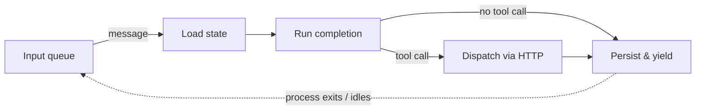

# Infinity Runtime

The Infinity Runtime is a Rust framework for building **massively concurrent** agentic systems, light enough to fit **75k agents in the memory of a Raspberry Pi**. Infinity does for agents what async did for threads: instead of blocking on slow tools, Infinity agents run them concurrently, yield while they wait, and cost nothing until the next event arrives.

The runtime executes each agent as a sequence of short **execution slices**. During a slice, the runtime loads the thread's conversation from a pluggable store, runs one model completion, and persists the resulting turn. If the model calls a tool, the runtime dispatches the invocation as a fire-and-forget HTTP request and the slice ends. The tool result will arrive later as a message on the thread's input queue, which also carries user messages, subscription events, child-thread reports, and timer wake-ups. This means that between slices, an agent exists only as stored history (roughly 100 KB after twenty tool-calling turns). [Architecture](./architecture.md) covers the slice lifecycle, turn durability, and message ordering.

```mermaid
flowchart LR
    Q[Input queue] -->|message| L[Load state]
    L --> C[Run completion]
    C -->|tool call| D[Dispatch via HTTP]
    C -->|no tool call| Y
    D --> Y[Persist & yield]
    Y -.->|process exits / idles| Q
```

Threads are grouped into [agent systems](./agent-systems/overview.md), which are pools of threads that share stores, tools, and model providers. As in an actor system, threads share no state and communicate only through in-order messages to each thread's queue. A root thread holds a user-facing conversation, while subagents, compaction workers, and subscription-event handlers run as child threads in the same conversation tree. The [quickstart](./quickstart/launching-your-first-agent.md) builds a system with in-memory stores, then adds [custom Rust tools](./quickstart/adding-tools.md) and [external tool servers](./quickstart/connecting-rap-and-mcp.md).

Because a slice never blocks, the same agent code can run embedded in a resident process or on serverless infrastructure. When embedded, the built-in local driver gives each thread a channel and a worker task, and streams events to your code through thread handles; the Infinity Code daemon embeds the runtime this way. On AWS Lambda, each SQS FIFO delivery drives one step of the runtime, and the process exits afterward. In that deployment, conversation history lives in Aurora DSQL, deduplication state lives in DynamoDB, and durable timers are backed by SQS delays and EventBridge schedules; the included CDK constructs provision all of this, as described in [Serverless Deployments](./serverless/quickstart.mdx). Tools, providers, and tests written against the core will run unchanged in both environments.

In-process tools implement the `Tool` trait in Rust. Networked tools speak the [Reactive Agent Protocol](/docs/rap/what-is-rap) (RAP), which delivers results and subscription events through callbacks instead of held connections; this means that a tool server can answer an agent that currently has no process. MCP servers connect in process through the `infinity-mcp-bridge` crate, or run unchanged behind a RAP proxy in cloud deployments. Every agent also receives [built-in tools](./built-in/built-in-tools.md) for sleeping and for [spawning child threads](./built-in/threading.md). All inference goes through the [`ModelProvider` trait](./model-providers.md), so model backends are as pluggable as stores.

Start with the [quickstart](./quickstart/launching-your-first-agent.md), then read [Agent Systems](./agent-systems/overview.md) for the full API. [The Low-Level API](./low-level/overview.md) documents the pieces underneath, for applications that need to arrange them differently.
