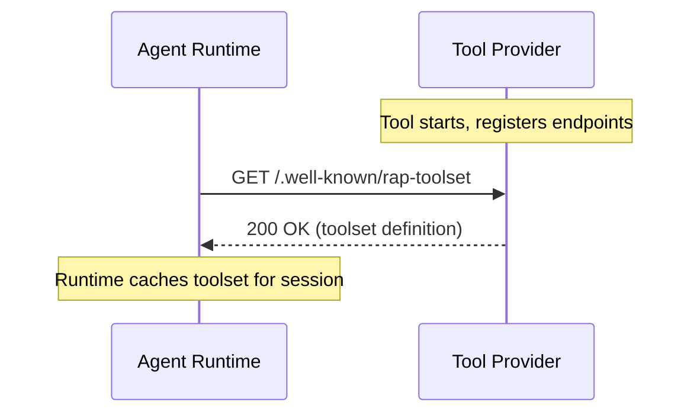
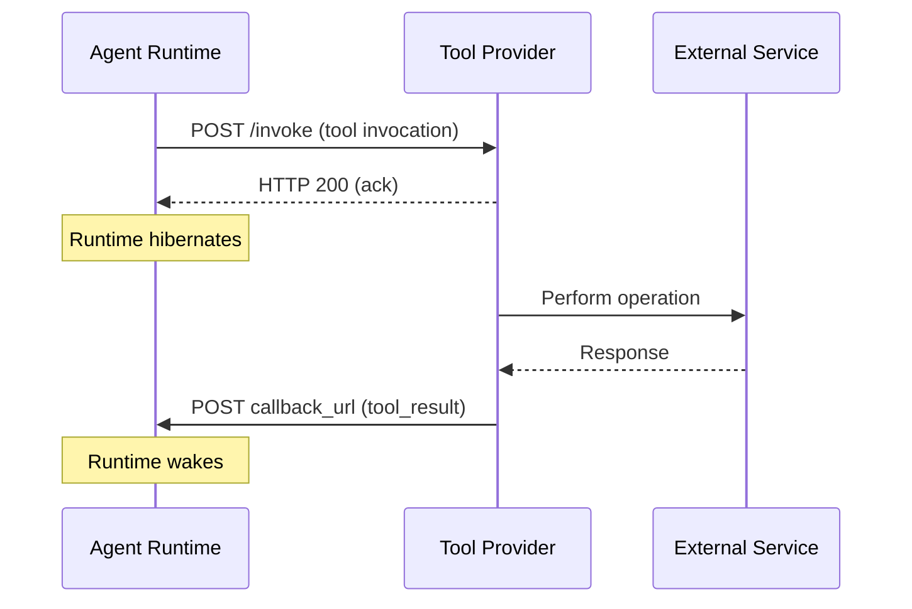

# Protocol Lifecycle

The Reactive Agent Protocol defines the lifecycle of two independent participants: the **agent runtime** and the **tool provider**. Each has its own startup, execution, and shutdown behavior. Understanding both lifecycles — and how they interact — is essential for building correct RAP implementations.

The runtime lifecycle is ephemeral and message-driven: it starts when a message arrives, processes it, and exits. The tool lifecycle is service-oriented: it starts independently, registers its capabilities, and processes invocations asynchronously over an indefinite lifespan. The two lifecycles intersect at two points — [tool invocation](/docs/rap/spec/basic/tool-invocation) and [tool result](/docs/rap/spec/basic/tool-result) — connected by the callback URL.

## Tool Provider Lifecycle

Most developers interact with RAP by building tools. A tool provider is an HTTP service that exposes a [toolset](/docs/rap/spec/basic/toolsets) of operations, receives invocations from agent runtimes, and delivers results asynchronously via callback URLs.

### Startup

When a tool provider starts, it MUST expose two HTTP endpoints:

1. A **discovery endpoint** at `/.well-known/rap-toolset` that returns the tool's [toolset definition](/docs/rap/spec/basic/toolsets)
2. An **invocation endpoint** at the URL specified in the toolset's `endpoint` field

The tool provider SHOULD also expose a **thread closure endpoint** at `/close_thread` to receive best-effort cleanup notifications from the runtime. See [Thread Closure](/docs/rap/spec/basic/thread-closure) for details.

Tool providers that track in-flight invocations or maintain [subscriptions](/docs/rap/spec/server/subscription-events) SHOULD additionally expose a **status endpoint** at `/tool_call_status`, which lets runtimes ask whether a previously dispatched tool call is still alive. See [Tool Call Status Check](/docs/rap/spec/basic/tool-call-status) for details.

The tool provider MUST be ready to serve both required endpoints before accepting traffic. The discovery endpoint is how runtimes learn what operations the tool supports — if it is unavailable or returns an invalid toolset, no runtime will be able to invoke the tool.

### Ready State

Once started, the tool provider enters a ready state where it accepts invocations indefinitely. Unlike the agent runtime, a tool provider is a long-lived service — it does not exit between requests. The tool provider:

- MUST respond to discovery requests (`GET /.well-known/rap-toolset`) with the current toolset definition
- MUST accept invocations (`POST` to the invocation endpoint) and acknowledge them immediately with HTTP 200
- MUST process invocations asynchronously and deliver results to the `callback_url`
- MAY handle multiple concurrent invocations from different runtimes and conversation threads

The tool provider is responsible for its own scaling, availability, and failure recovery. The protocol does not prescribe how the tool is hosted — it MAY be a Lambda function, a container service, a bare-metal server, or any other HTTP-capable infrastructure.

### Processing an Invocation

When the tool provider receives a [tool invocation](/docs/rap/spec/basic/tool-invocation), it MUST follow this sequence:

1. **Acknowledge** — Return HTTP 200 immediately, before doing any work. This confirms receipt to the runtime.
2. **Validate** — Verify that the `operation` field references a supported operation and that the `arguments` conform to the expected schema.
3. **Execute** — Perform the requested operation asynchronously.
4. **Deliver** — POST a [tool result](/docs/rap/spec/basic/tool-result) to the `callback_url` when execution completes.

The tool MUST NOT block the HTTP acknowledgement on processing. The acknowledgement and the result are separate HTTP transactions — this decoupling is what enables the runtime to hibernate between them.

If validation fails (unknown operation, malformed arguments), the tool SHOULD still acknowledge with HTTP 200 and deliver the error asynchronously as a [tool result](/docs/rap/spec/basic/tool-result) with an error description. The only exception is a stale `toolset_version` — in that case, the tool SHOULD return HTTP 409 Conflict so the runtime can refresh its cached toolset.

### Callback Delivery

After processing an invocation, the tool MUST deliver exactly one of the following to the `callback_url`:

| Message | When to use |
|---|---|
| [`tool_result`](/docs/rap/spec/basic/tool-result) | The operation completed (successfully or with an error) |
| [`oauth`](/docs/rap/spec/server/oauth) | The operation requires user authorization before it can proceed |

Tools MUST NOT silently drop invocations. Every invocation MUST eventually produce a callback message. If the tool encounters an unrecoverable error, it MUST deliver a `tool_result` with the error description — the LLM can then reason about the failure and decide how to proceed.

When delivering results, the tool MUST include the `group_id` and `id` from the original invocation so the runtime can route the result to the correct conversation thread and match it to the pending tool call. Tools SHOULD implement retry logic with exponential backoff for callback delivery failures (HTTP 5xx, connection timeouts). Tools SHOULD NOT retry on HTTP 4xx responses.

### Subscription Tools

Tools that create ongoing subscriptions have an extended lifecycle. After delivering the initial `tool_result` confirming the subscription, the tool enters a persistent listening state:

1. **Store** — Durably persist the `callback_url`, `group_id`, and `id` from the original invocation
2. **Confirm** — Deliver a `tool_result` confirming the subscription was created
3. **Listen** — Monitor the external event source for matching events
4. **Notify** — For each matching event, deliver a [`subscription_event`](/docs/rap/spec/server/subscription-events) to the stored `callback_url`
5. **Cancel** — Stop delivering events when the subscription is explicitly cancelled

Because subscription events may arrive days or weeks after the original invocation, the tool MUST store callback information durably. See [Subscription Events](/docs/rap/spec/server/subscription-events) for the full specification.

### Schema Evolution

Tool providers that update their toolset definition MUST account for the fact that runtimes cache toolset definitions for the duration of an agent session. A runtime that fetched the toolset before a breaking change will continue sending invocations with the old schema.

Tool providers MUST handle stale invocations gracefully — either by maintaining backward compatibility or by returning an error via the normal [tool result](/docs/rap/spec/basic/tool-result) path. Tool providers MUST NOT fail silently when receiving arguments that match a previous schema version.

### Shutdown

The protocol does not define a shutdown handshake for tool providers. When a tool provider shuts down:

- Active invocations that have been acknowledged but not yet completed MAY be lost. Tool providers SHOULD persist in-flight work to allow recovery on restart. Tool providers that expose a [`/tool_call_status`](/docs/rap/spec/basic/tool-call-status) endpoint allow runtimes to detect invocations that were lost this way and prune them instead of waiting forever.
- Active subscriptions SHOULD continue to function if the tool provider restarts. Tools that store subscription state durably can resume event delivery after restart.
- The discovery endpoint becomes unavailable. Runtimes that have already cached the toolset definition will continue to send invocations to the invocation endpoint, which will fail with connection errors. The runtime SHOULD record these failures as tool results with error descriptions.

### Thread Closure Notification

When a runtime closes a conversation thread, it sends a best-effort notification to every tool server so they can clean up thread-specific resources (e.g., cached sandboxes, temporary workspaces). The runtime POSTs a `{"thread_id": "..."}` payload to each tool server's `/close_thread` endpoint, where `thread_id` corresponds to the `group_id` of the closed thread.

This notification is strictly best-effort — the runtime MUST NOT retry on failure, and tool servers MAY ignore it entirely. Tool servers that do handle the notification MUST always respond with HTTP 200. See [Thread Closure](/docs/rap/spec/basic/thread-closure) for the full specification.

### Tool Call Status Checks

Because both participants can restart independently, a runtime may find itself waiting on a tool call that the tool provider has given up on — for example, an invocation that was in flight when the tool provider restarted and lost its in-memory state. To recover from this, a runtime that boots with pending tool calls or active subscriptions in its persisted state SHOULD query each originating tool server's `/tool_call_status` endpoint. If the server answers that a call is no longer alive, the runtime SHOULD prune it — injecting a synthetic failed tool result (or a synthetic final subscription event) so the LLM can reason about the failure and retry.

Unlike the best-effort notifications, the status check is a request/response query: the runtime interprets the response body. An `"alive": false` answer — or a response showing the server does not support the endpoint (4xx / invalid body) — means the call is lost and SHOULD be pruned; only transport errors and transient 5xx responses leave the call pending. Tool providers that perform asynchronous work or maintain subscriptions SHOULD therefore implement `/tool_call_status`, or their in-flight work will be treated as failed whenever a runtime restarts. See [Tool Call Status Check](/docs/rap/spec/basic/tool-call-status) for the full specification.

## Concurrency

### Runtime Concurrency

Runtimes MUST ensure that messages within a single conversation thread (`group_id`) are processed serially. If two messages for the same thread arrive concurrently — for example, a user message and a tool result — processing them simultaneously could corrupt conversation state by producing conflicting writes to the persisted history.

Implementations MAY use any mechanism to enforce serial processing: FIFO queues with message group IDs, database-level locks, optimistic concurrency control with retry logic, or single-threaded processing per thread. The key invariant is that within a single `group_id`, only one message is processed at a time.

Messages for different threads (`group_id` values) MAY be processed concurrently, since they operate on independent conversation state.

### Tool Concurrency

Tool providers MAY process multiple invocations concurrently. Each invocation is independent — it carries its own `callback_url`, `group_id`, and `id`. Tools MUST ensure that concurrent processing does not cause results to be delivered to the wrong callback URL or with the wrong identifiers.

## Interruption

Because the runtime is stateless and message-driven, interruptions are handled naturally. If a user sends a message while the agent is waiting for a tool result, the runtime starts, loads state, and processes the user message. When the tool result arrives later, it is processed as a separate invocation. The LLM sees both in its context and can reason about the sequence of events.

Runtimes SHOULD ensure that agents remain responsive to user input even while waiting for long-running tool operations.

## Error Handling

### Runtime Errors

Because the runtime is ephemeral and processes a single message per invocation, error handling must account for failures at each lifecycle phase:

| Phase | Error | Behavior |
|---|---|---|
| Wake | State load failure | MUST NOT proceed. SHOULD return an error to the caller. |
| Wake | Toolset fetch failure | SHOULD proceed with previously cached toolsets if available. MUST report the error if no cached toolsets exist. |
| Execute | LLM completion failure | SHOULD persist any state changes (e.g., the incoming message) and report the error. |
| Execute | Tool dispatch failure | SHOULD record the failure as a tool result with an error description, allowing the LLM to reason about it on the next invocation. |
| Hibernate | State persist failure | MUST signal an error. Implementations SHOULD use idempotent state writes to allow safe retries. |

### Tool Errors

Tool providers MUST deliver errors through the normal callback mechanism rather than relying on HTTP status codes:

| Error | Behavior |
|---|---|
| Unknown operation | Acknowledge with HTTP 200, deliver error via `tool_result`. |
| Invalid arguments | Acknowledge with HTTP 200, deliver error via `tool_result`. |
| Stale toolset version | Return HTTP 409 Conflict. |
| Processing failure | Deliver error via `tool_result` with actionable description. |
| Callback delivery failure | Retry with exponential backoff. |

Tools MUST NOT silently drop errors. The LLM cannot reason about failures it never sees.

## Timeouts

The protocol does not define timeouts for tool execution. Tools MAY take arbitrarily long to return results — this is a deliberate design choice that enables use cases like multi-hour CI pipelines, human approval workflows, and indefinite event subscriptions.

However, runtimes MAY implement application-level timeouts that generate synthetic error results after a configurable period, allowing the LLM to reason about the timeout and decide whether to retry or inform the user. Runtimes that implement timeouts SHOULD document their timeout behavior clearly. Tools SHOULD document their expected execution time ranges so that runtimes can set appropriate thresholds.

## Security Considerations

### Runtime Security

Runtimes MUST validate all incoming callback messages against the expected schema and SHOULD verify that messages originate from a tool that was actually invoked — for example, by checking that the `group_id` and `id` correspond to a pending tool call. Runtimes MUST NOT inject unmatched results into any conversation.

Runtimes SHOULD implement idempotent message processing to handle duplicate deliveries gracefully, since network retries may cause the same message to arrive more than once.

### Tool Security

Tool providers MUST validate all input arguments before processing to guard against injection attacks, unexpected data types, or values outside acceptable ranges. Tools SHOULD rate-limit invocations to prevent abuse, and SHOULD sanitize output before sending results to the callback URL to avoid leaking internal implementation details.

Tools that persist callback URLs for subscriptions MUST protect them as sensitive data — a compromised callback URL allows arbitrary message injection into an agent's conversation.
