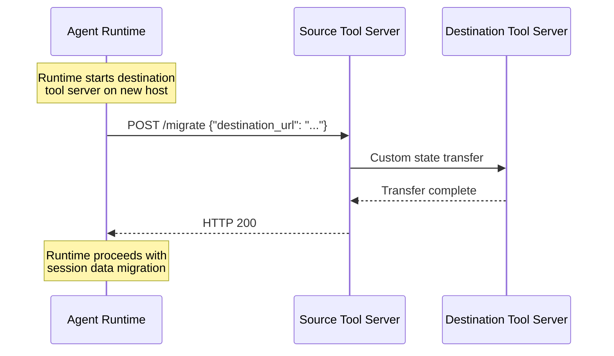

# Migration

The Reactive Agent Protocol supports **session migration** — moving an agent session from one host to another while preserving tool server state. Migration is coordinated by the agent runtime, which notifies each tool server that needs to transfer its state to a corresponding server on the destination host.

Not all tool servers maintain session-specific state that requires migration. Tool servers that do MUST declare this in their [toolset manifest](/docs/rap/spec/basic/toolsets) and MUST implement the migration endpoint described below.

## Toolset Manifest

Tool servers that maintain session-specific state requiring migration MUST set `needsMigration` to `true` in their toolset manifest:

```json
{
  "name": "sandbox-tools",
  "endpoint": "https://tool.example.com/invoke",
  "needsMigration": true,
  "tools": [...]
}
```

| Field | Type | Default | Description |
|---|---|---|---|
| `needsMigration` | `boolean` | `false` | When `true`, the runtime MUST call the migration endpoint before completing a session migration. |

Tool servers that are stateless or do not need to transfer state between hosts SHOULD leave this field unset or set it to `false`. The runtime MUST NOT call the migration endpoint on servers where `needsMigration` is `false` or absent.

## Migration Endpoint

Tool servers that declare `needsMigration: true` MUST expose a migration endpoint at `/migrate` on the same base URL as their discovery and invocation endpoints.

### Request

```http
POST https://tool.example.com/migrate
Content-Type: application/json

{
  "session_id": "abc-123",
  "destination_url": "http://127.0.0.1:9123"
}
```

| Field | Type | Required | Description |
|---|---|---|---|
| `session_id` | `string` | Yes | The root thread ID of the session being migrated. |
| `destination_url` | `string` | Yes | The base URL of the destination tool server instance where state should be transferred. |

The `destination_url` points to a running instance of the same tool server on the destination host. The runtime is responsible for ensuring this instance is reachable from the source server — for example, via SSH tunnels when the source and destination are on different hosts.

### Response

The tool server MUST respond with HTTP 200 only after the migration is fully complete — that is, after all session-specific state has been successfully transferred to the destination server. The runtime will not proceed with the session migration until it receives this response.

```http
HTTP/1.1 200 OK
```

If migration fails, the tool server MUST respond with an appropriate HTTP error status (4xx or 5xx) and SHOULD include a descriptive error message in the response body. The runtime SHOULD abort the session migration and report the error.

### State Transfer

The protocol does not prescribe how tool servers transfer state between source and destination instances. Tool servers are free to use any mechanism — custom HTTP API endpoints, file transfer, database replication, or any other approach appropriate for their state model.

The only requirements are:

1. The source server MUST NOT return HTTP 200 from `/migrate` until the destination server has fully received and is ready to serve the migrated state.
2. After a successful migration, the source server's state for the migrated session MAY be cleaned up by the runtime via the normal [thread closure](/docs/rap/spec/basic/thread-closure) notification.



## Runtime Behavior

When migrating a session, the runtime MUST follow this sequence:

1. **Shut down** the agent loop for the session being migrated.
2. **Start** tool server instances on the destination host using the destination's tool configuration.
3. **Establish connectivity** between source and destination tool servers (e.g., via SSH tunnels for cross-host migrations).
4. **Call `/migrate`** on each source tool server that has `needsMigration: true`, providing the corresponding destination server's URL.
5. **Wait** for all migration requests to complete successfully.
6. **Transfer** the session's conversation data to the destination.
7. **Clean up** the source session.

If any tool server migration fails, the runtime SHOULD abort the entire session migration and report the error. Partial migrations — where some tool servers have migrated but others have not — SHOULD be avoided.

## Security Considerations

The `destination_url` provided to tool servers may point to a server on a different host, potentially accessible only via tunneled connections. Tool servers MUST validate that the destination URL is reachable before attempting state transfer and SHOULD use timeouts to avoid hanging indefinitely.

Tool servers SHOULD NOT expose sensitive credentials or secrets in their migration payloads. If state includes sensitive data, tool servers SHOULD encrypt it in transit or use authenticated connections between source and destination instances.
