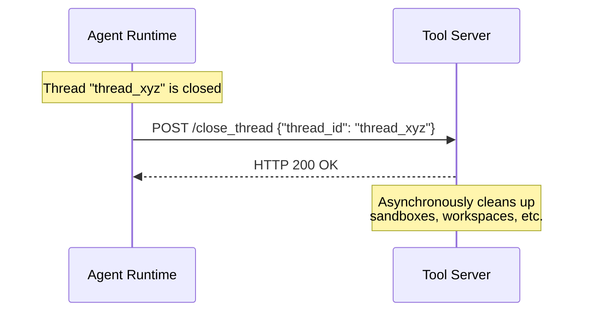

# Thread Closure Notification

A thread closure notification is a best-effort message sent from the runtime to every known tool server when a conversation thread is closed. The runtime POSTs to the tool server's `/close_thread` endpoint to inform it that the thread identified by a given `group_id` will not receive any further invocations. Tool servers MAY use this signal to clean up thread-specific resources such as cached sandboxes, temporary workspaces, or subscription state.

This notification is **advisory**. Tool servers are free to ignore it entirely, and the runtime MUST NOT depend on the notification being received or acted upon. The protocol treats thread closure as a best-effort optimization: it helps tool servers release resources sooner, but all tool servers MUST be resilient to never receiving it (for example, if the runtime crashes before sending the notification).

## Request

The runtime MUST send the thread closure notification as an HTTP POST with `Content-Type: application/json` to the tool server's `/close_thread` endpoint.

```http
POST https://tool.example.com/close_thread
Content-Type: application/json

{
  "thread_id": "thread_xyz"
}
```

The `/close_thread` path is relative to the tool server's base URL, the same base URL used to derive the `/.well-known/rap-toolset` [discovery endpoint](/docs/rap/spec/basic/toolsets#discovery-endpoint). For example, if the tool server's base URL is `https://tool.example.com`, the runtime POSTs to `https://tool.example.com/close_thread`.

## Fields

| Field | Type | Required | Description |
|---|---|---|---|
| `thread_id` | `string` | Yes | The conversation thread identifier (`group_id`) of the thread being closed. This is the same value that was sent as `group_id` in [tool invocations](/docs/rap/spec/basic/tool-invocation) to this thread. |

## Response

The tool server MUST return HTTP 200 to acknowledge receipt, regardless of whether it intends to act on the notification.

```http
HTTP/1.1 200 OK
```

The response body is not read by the runtime. The tool server MUST NOT use non-200 status codes to signal that cleanup failed: the notification is fire-and-forget, and the runtime does not interpret the response.

## Best-Effort Semantics

Thread closure notifications are **best-effort** by design. The protocol explicitly does not guarantee delivery, and neither runtimes nor tool servers should treat this notification as a reliable lifecycle event:

- **No retries.** If the notification fails (network error, timeout, non-200 response), the runtime MUST NOT retry. The notification is a single-shot attempt.
- **No ordering guarantees.** The runtime sends the notification to all known tool servers concurrently. Tool servers MUST NOT assume any ordering relative to other notifications or invocations.
- **No delivery guarantee.** The runtime MAY fail to send the notification entirely, for example if the runtime process is terminated before it can dispatch the request. Tool servers MUST be designed to function correctly even if they never receive a closure notification.
- **Idempotent handling.** Tool servers SHOULD handle duplicate notifications for the same `thread_id` gracefully. The runtime does not guarantee exactly-once delivery.

Because this notification is advisory, tool servers SHOULD NOT rely on it as the sole mechanism for resource cleanup. Tool servers SHOULD implement independent cleanup strategies, such as TTL-based expiration or periodic garbage collection, to handle cases where the notification is never received.

## Resource Cleanup

The primary use case for thread closure notifications is resource cleanup. During a thread's lifetime, tool servers may accumulate thread-specific state:

- **Sandboxed environments**: Filesystem snapshots, container instances, or temporary directories created to isolate tool execution for a particular thread.
- **Cached workspaces**: Version control workspaces (e.g., `jj` or `git` worktrees) that persist across multiple invocations within the same thread.
- **Subscription state**: Active subscriptions tied to the thread that should be cancelled when the thread ends.
- **Temporary files**: Build artifacts, logs, or intermediate results accumulated during the thread's execution.

When a tool server receives a `/close_thread` notification, it SHOULD clean up any resources associated with the given `thread_id`. Cleanup failures SHOULD be logged but MUST NOT cause the endpoint to return a non-200 status code. The tool server MAY perform cleanup asynchronously: the endpoint SHOULD return 200 OK immediately and process the cleanup in the background.



## Dispatch Behavior

When the runtime closes a thread, it MUST send a `/close_thread` notification to every tool server that the runtime is configured to use. The runtime sends the notification to all servers regardless of whether the closed thread actually invoked tools on that server, so tool servers MUST handle notifications for unknown `thread_id` values gracefully (for example, by logging the event and returning 200 OK).

The runtime SHOULD send all notifications concurrently and MUST NOT block the thread closure operation on their completion. If the runtime manages multiple tool servers, a failure to notify one server MUST NOT prevent notification of the others.

## Security Considerations

Tool servers MUST validate that `/close_thread` requests are authentic, for example by requiring the same authentication mechanism used for [tool invocations](/docs/rap/spec/basic/tool-invocation) (AWS SigV4, bearer tokens, mutual TLS, etc.). An unauthenticated `/close_thread` endpoint would allow an attacker to trigger resource cleanup for arbitrary threads, potentially disrupting active conversations.

Tool servers MUST NOT expose sensitive information about thread state in the response body. The response SHOULD be an empty 200 OK. Tool servers SHOULD rate-limit the `/close_thread` endpoint to prevent abuse.

Tool servers MUST treat the `thread_id` as untrusted input and MUST validate it before using it to look up or delete resources. In particular, tool servers MUST guard against path traversal or injection attacks when the `thread_id` is used to locate filesystem resources.
