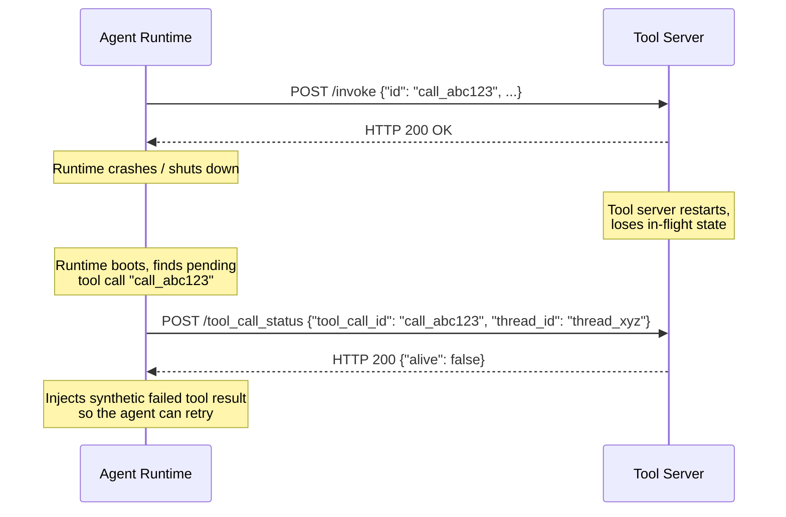

# Tool Call Status Check

A tool call status check is a query sent from the runtime to a tool server to ask whether a previously dispatched tool call is still alive — that is, whether the tool server still intends to deliver a [tool result](/docs/rap/spec/basic/tool-result) for it, or still maintains an active [subscription](/docs/rap/spec/server/subscription-events) established by it. The runtime POSTs to the tool server's `/tool_call_status` endpoint with the identifiers of the original invocation, and the tool server answers with a JSON body indicating whether it still has a record of the call.

Unlike the [thread closure](/docs/rap/spec/basic/thread-closure) and [tool cancellation](/docs/rap/spec/basic/tool-cancellation) notifications — which are fire-and-forget — the status check is a **request/response** message: the runtime reads and interprets the response body.

The primary use case is recovery after a runtime restart. RAP's fire-and-forget invocation model means a conversation can be waiting indefinitely for a callback — a pending tool result or the next subscription event. If the runtime crashes or shuts down while a call is in flight, and the tool server meanwhile gives up on the call (for example, because the tool server itself restarted and lost its in-memory state), the conversation would hang forever waiting for a callback that will never arrive. The status check lets a rebooting runtime detect these orphaned calls and prune them, so the agent can observe the failure and recover instead of hanging.

A single message covers both pending tool calls and subscriptions: a subscription is identified by the `tool_call_id` of the tool call that established it.

## Request

The runtime MUST send the status check as an HTTP POST with `Content-Type: application/json` to the tool server's `/tool_call_status` endpoint.

```http
POST https://tool.example.com/tool_call_status
Content-Type: application/json

{
  "thread_id": "thread_xyz",
  "tool_call_id": "call_abc123"
}
```

The `/tool_call_status` path is relative to the tool server's base URL — the same base URL used to derive the `/.well-known/rap-toolset` [discovery endpoint](/docs/rap/spec/basic/toolsets#discovery-endpoint), `/close_thread`, and `/cancel_tool_call`. For example, if the tool server's base URL is `https://tool.example.com`, the runtime POSTs to `https://tool.example.com/tool_call_status`.

### Fields

| Field | Type | Required | Description |
|---|---|---|---|
| `thread_id` | `string` | Yes | The conversation thread identifier (`group_id`) of the thread containing the tool call. This is the same value that was sent as `group_id` in the original [tool invocation](/docs/rap/spec/basic/tool-invocation). |
| `tool_call_id` | `string` | Yes | The unique identifier of the tool call to query. This is the same value that was sent as `id` in the original [tool invocation](/docs/rap/spec/basic/tool-invocation). For subscriptions, this is the `id` of the tool call that established the subscription. |

## Response

A tool server that implements the endpoint MUST respond with HTTP 200 and a JSON body:

```http
HTTP/1.1 200 OK
Content-Type: application/json

{
  "alive": true
}
```

### Fields

| Field | Type | Required | Description |
|---|---|---|---|
| `alive` | `boolean` | Yes | Whether the tool server still tracks the tool call. See [Query Semantics](#query-semantics). |

## Query Semantics

`"alive": true` means the tool server still tracks the tool call, in either of two senses:

- **Pending tool call** — the server is still processing the invocation and a [tool result](/docs/rap/spec/basic/tool-result) will eventually be delivered to the callback URL.
- **Active subscription** — the server still maintains a subscription established by that tool call, and further [subscription events](/docs/rap/spec/server/subscription-events) may be delivered.

`"alive": false` means the tool server has no record of the tool call — for example, its state was lost in a restart, the call completed long ago, or it was cancelled — and the runtime SHOULD NOT expect any further callbacks for it.

Tool servers MUST answer `"alive": false` for unknown `tool_call_id` values. Detecting calls the server has given up on (or never heard of) is the entire purpose of this message; answering anything else for an unknown identifier would defeat it.

The status check is read-only: tool servers MUST NOT cancel, complete, or otherwise mutate the state of a tool call in response to a status query.

:::note
There is an inherent race between a status check and callback delivery: a tool result or subscription event MAY be in flight while the server reports on the call's status. Runtimes MUST tolerate receiving a callback for a call they have already pruned (typically by ignoring it), and tool servers MUST NOT assume a status query implies the runtime has or has not received prior callbacks.
:::

## Runtime Error Semantics

Responses that do not carry a valid `"alive": true` answer fall into two categories with opposite handling.

**Endpoint unsupported — treat the call as dead.** A tool server that responds but does not support the status check cannot be tracking the tool call in a way that survives restarts, so the runtime SHOULD treat the call as lost and prune it, exactly as if the server had answered `"alive": false`:

- A 4xx response status — including a 404 from a tool server that predates this endpoint
- A 2xx response whose body cannot be parsed as the JSON object above

This is the default because a hung conversation is worse than a spurious failure: a pruned call surfaces an explicit error the agent can retry, whereas an unpruned dead call hangs the thread forever. Tool servers that perform asynchronous work or maintain subscriptions SHOULD therefore implement `/tool_call_status` — servers that do not will have their pending calls and subscriptions treated as failed whenever the runtime restarts.

**Server unavailable — treat the status as unknown.** The runtime MUST NOT prune based on a failure to get an answer at all, since the server may only be temporarily unavailable and may still deliver callbacks:

- A transport error (connection failure, timeout)
- A 5xx response status (transient server error)

In the unknown case the call simply stays pending, exactly as it would have before this message existed.

## Recovery After Runtime Restart

On boot, a runtime SHOULD reconcile its persisted conversation state against the tool servers: for every pending tool call and every active subscription it is still waiting on, it SHOULD query the tool server that originally received the invocation. When the server answers `"alive": false` — or responds without supporting the endpoint — the runtime SHOULD prune the orphaned call:

- **Pending tool call** — inject a synthetic failed [tool result](/docs/rap/spec/basic/tool-result) into the conversation (e.g. `"Error: the tool server is no longer processing this call"`), so the LLM can reason about the failure and retry if appropriate.
- **Active subscription** — inject a synthetic final [subscription event](/docs/rap/spec/server/subscription-events) reporting the loss and remove the subscription from active tracking, so the agent can re-subscribe if appropriate.



Pruning is a SHOULD, not a MUST — runtimes MAY apply additional heuristics (e.g. grace periods, retry-before-prune) as long as they never prune on unknown status (server unreachable or 5xx).

## Dispatch Behavior

Unlike [tool cancellation](/docs/rap/spec/basic/tool-cancellation) — which is broadcast to every configured tool server — the status check SHOULD be sent only to the tool server that originally received the invocation, since only that server can answer authoritatively. Runtimes that cannot determine the originating server MAY query multiple servers instead; in that case they SHOULD treat the call as alive if any server reports `"alive": true`, and as unknown (rather than dead) if any queried server is unavailable — a `"alive": false` from a server that never received the invocation is not authoritative.

Runtimes SHOULD issue status checks for independent tool calls concurrently and SHOULD NOT block conversation processing on their completion.

## Security Considerations

Tool servers MUST validate that `/tool_call_status` requests are authentic — for example, by requiring the same authentication mechanism used for [tool invocations](/docs/rap/spec/basic/tool-invocation) (AWS SigV4, bearer tokens, mutual TLS, etc.). An unauthenticated status endpoint would allow an attacker to probe for the existence of tool calls and enumerate active subscriptions.

Tool servers MUST treat the `tool_call_id` and `thread_id` as untrusted input and MUST validate them before using them to look up state. The response MUST NOT expose any information about the tool call beyond the `alive` boolean — no arguments, partial results, or internal state. Tool servers SHOULD rate-limit the `/tool_call_status` endpoint to prevent abuse.
