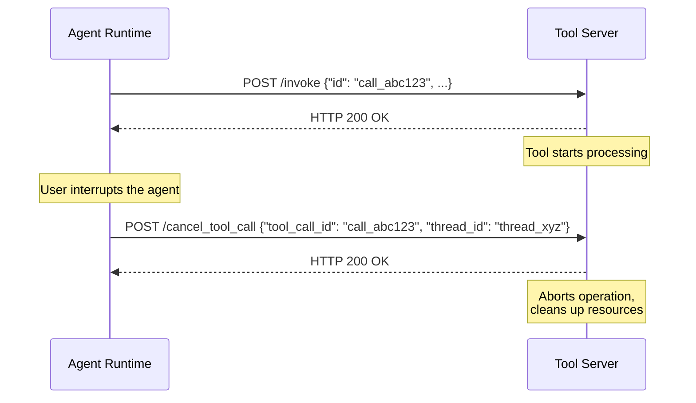

# Tool Cancellation Notification

A tool cancellation notification is a best-effort message sent from the runtime to a tool server when a previously dispatched tool call is cancelled — typically because the user interrupted the agent while a tool was still in flight. The runtime POSTs to the tool server's `/cancel_tool_call` endpoint to inform it that the tool call identified by a given `tool_call_id` within a specific `thread_id` should be aborted. Tool servers MAY use this signal to terminate in-flight operations such as running processes, pending HTTP requests, or long-running computations.

This notification is **advisory**. Tool servers are free to ignore it entirely, and the runtime MUST NOT depend on the notification being received or acted upon. The protocol treats tool cancellation as a best-effort optimization — it helps tool servers release resources and stop unnecessary work sooner, but all tool servers MUST be resilient to never receiving it (for example, if the runtime crashes before sending the notification, or if the tool call completes before the notification arrives).

## Request

The runtime MUST send the tool cancellation notification as an HTTP POST with `Content-Type: application/json` to the tool server's `/cancel_tool_call` endpoint.

```http
POST https://tool.example.com/cancel_tool_call
Content-Type: application/json

{
  "thread_id": "thread_xyz",
  "tool_call_id": "call_abc123"
}
```

The `/cancel_tool_call` path is relative to the tool server's base URL — the same base URL used to derive the `/.well-known/rap-toolset` [discovery endpoint](/docs/rap/spec/basic/toolsets#discovery-endpoint). For example, if the tool server's base URL is `https://tool.example.com`, the runtime POSTs to `https://tool.example.com/cancel_tool_call`.

## Fields

| Field | Type | Required | Description |
|---|---|---|---|
| `thread_id` | `string` | Yes | The conversation thread identifier (`group_id`) of the thread containing the cancelled tool call. This is the same value that was sent as `group_id` in the original [tool invocation](/docs/rap/spec/basic/tool-invocation). |
| `tool_call_id` | `string` | Yes | The unique identifier of the tool call to cancel. This is the same value that was sent as `id` in the original [tool invocation](/docs/rap/spec/basic/tool-invocation). |

## Response

The tool server MUST return HTTP 200 to acknowledge receipt, regardless of whether it intends to act on the notification or whether the tool call was found.

```http
HTTP/1.1 200 OK
```

The response body is not read by the runtime. The tool server MUST NOT use non-200 status codes to signal that the cancellation failed or that the tool call was not found — the notification is fire-and-forget, and the runtime does not interpret the response.

## Best-Effort Semantics

Tool cancellation notifications are **best-effort** by design. The protocol explicitly does not guarantee delivery, and neither runtimes nor tool servers should treat this notification as a reliable lifecycle event:

- **No retries.** If the notification fails (network error, timeout, non-200 response), the runtime MUST NOT retry. The notification is a single-shot attempt.
- **No ordering guarantees.** The notification MAY arrive after the tool has already completed and sent its result. Tool servers MUST handle this gracefully.
- **No delivery guarantee.** The runtime MAY fail to send the notification entirely — for example, if the runtime process is terminated before it can dispatch the request. Tool servers MUST be designed to function correctly even if they never receive a cancellation notification.
- **Idempotent handling.** Tool servers SHOULD handle duplicate notifications for the same `tool_call_id` gracefully. The runtime does not guarantee exactly-once delivery.
- **Race conditions.** A tool result callback and a cancellation notification may be in flight simultaneously. Tool servers MUST NOT assume that receiving a cancellation means the result was not delivered, and runtimes MUST NOT assume that sending a cancellation means the result will not arrive.

Because this notification is advisory, tool servers SHOULD NOT rely on it as the sole mechanism for managing in-flight operations. Tool servers SHOULD implement independent timeout and cleanup strategies to handle cases where the notification is never received.

Conversely, runtimes SHOULD NOT rely on cancellation notifications to keep their view of in-flight work consistent with the tool server's. A runtime can ask a tool server whether a dispatched call is still being processed at all — for example, after a restart — using the [tool call status check](/docs/rap/spec/basic/tool-call-status), which detects calls the tool server has lost or given up on entirely.

## Cancellation Behavior

When a tool server receives a `/cancel_tool_call` notification, it MAY attempt to abort the identified operation. The specific behavior depends on the tool:

- **Process execution tools** — Kill the running process (e.g., send SIGTERM) and clean up associated resources such as temporary directories.
- **Long-running HTTP requests** — Abort pending upstream requests or API calls.
- **Computation tools** — Stop ongoing computation and release allocated resources.

Tool servers MAY still send a [tool result](/docs/rap/spec/basic/tool-result) after receiving a cancellation notification — for example, to report partial results or confirm the cancellation. The runtime MUST be prepared to receive tool results for cancelled tool calls and SHOULD handle them gracefully (typically by ignoring them, since the runtime has already injected a synthetic "interrupted" result into the conversation).



## Dispatch Behavior

When the runtime cancels a tool call, it SHOULD send a `/cancel_tool_call` notification to every tool server that the runtime is configured to use. The runtime sends the notification to all servers regardless of which server originally received the invocation — tool servers MUST handle notifications for unknown `tool_call_id` values gracefully (for example, by logging the event and returning 200 OK).

The runtime SHOULD send all notifications concurrently and MUST NOT block the cancellation operation on their completion. If the runtime manages multiple tool servers, a failure to notify one server MUST NOT prevent notification of the others.

## Security Considerations

Tool servers MUST validate that `/cancel_tool_call` requests are authentic — for example, by requiring the same authentication mechanism used for [tool invocations](/docs/rap/spec/basic/tool-invocation) (AWS SigV4, bearer tokens, mutual TLS, etc.). An unauthenticated `/cancel_tool_call` endpoint would allow an attacker to cancel in-flight operations for arbitrary tool calls, potentially disrupting active agent workflows.

Tool servers MUST NOT expose sensitive information about tool call state in the response body. The response SHOULD be an empty 200 OK. Tool servers SHOULD rate-limit the `/cancel_tool_call` endpoint to prevent abuse.

Tool servers MUST treat the `tool_call_id` and `thread_id` as untrusted input and MUST validate them before using them to look up or cancel operations.
