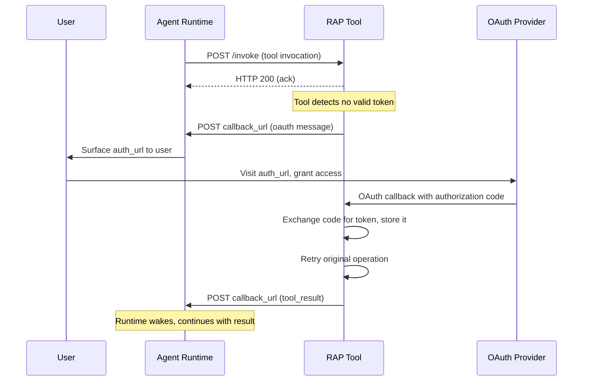

# OAuth

Tools that require user authorization can initiate an OAuth flow by sending an `oauth` message to the callback URL instead of a tool result. This allows tools to request user consent for accessing external services (e.g., GitHub, Slack, Google) without the runtime needing to know the authorization details in advance.

## OAuth Message

When a tool determines that user authorization is required, it MUST send an `oauth` message to the `callback_url`:

```http
POST https://agent.example.com/callback
Content-Type: application/json

{
  "type": "oauth",
  "group_id": "thread_xyz",
  "id": "call_abc123",
  "call_id": null,
  "auth_url": "https://github.com/login/oauth/authorize?client_id=abc&redirect_uri=..."
}
```

### Fields

| Field | Type | Required | Description |
|---|---|---|---|
| `type` | `string` | Yes | MUST be `"oauth"`. |
| `group_id` | `string` | Yes | Conversation thread identifier. MUST match the `group_id` from the original invocation. |
| `id` | `string` | Yes | Tool call identifier. MUST match the `id` from the original invocation. |
| `call_id` | `string \| null` | No | Secondary call identifier. If the original invocation included a `call_id`, it MUST be echoed here. |
| `auth_url` | `string` | Yes | The full OAuth authorization URL the user MUST visit to grant access. |

## Flow

The OAuth flow in RAP bridges the gap between a tool that needs credentials and a user who can grant them — without the runtime needing to understand the authorization mechanism.



The flow begins when the runtime dispatches a normal [tool invocation](/docs/rap/spec/basic/tool-invocation). The tool acknowledges immediately, then checks whether it holds a valid token for the `user_id` from the invocation. If no valid token exists, the tool sends an `oauth` message containing the authorization URL instead of a `tool_result`.

The runtime surfaces this URL to the user through whatever interface it provides — a clickable link in Slack, a CLI prompt, a web UI. The user visits the URL and completes the authorization flow directly with the OAuth provider. The provider redirects back to the tool's registered callback endpoint with an authorization code.

The tool exchanges the code for an access token, stores it, and retries the original operation using the new credentials. When the operation completes, the tool delivers a normal [tool result](/docs/rap/spec/basic/tool-result) to the callback URL. From the runtime's perspective, the tool call simply took longer than usual — the OAuth detour is entirely transparent.

## Runtime Behavior

The runtime MUST treat the `oauth` message as a special callback that requires user interaction before the tool call can complete. Upon receiving an `oauth` message, the runtime MUST surface the `auth_url` to the user in a way that allows them to visit it.

The runtime MUST keep the original tool call in a pending state until a `tool_result` eventually arrives from the tool. The runtime SHOULD inform the LLM that authorization is in progress, for example by injecting a status message into the conversation. The runtime MUST NOT retry the tool invocation itself — the tool is responsible for retrying the original operation after the user completes authorization.

## Tool Requirements

Tools that implement OAuth MUST detect when authorization is required before attempting the operation — typically by checking for a stored token associated with the `user_id` from the invocation. When no valid token exists, the tool MUST construct a valid OAuth authorization URL with appropriate scopes and a redirect URI pointing to the tool's own callback endpoint.

The tool MUST handle the OAuth callback to receive authorization codes, exchange them securely for access tokens, and store the resulting tokens associated with the `user_id`. After successful authorization, the tool MUST retry the original operation using the new token and MUST send a `tool_result` to the callback URL when the operation completes, whether the retry succeeds or fails.

Tools that require OAuth SHOULD include the OAuth provider identifier in the tool's [annotations](/docs/rap/spec/basic/toolsets#annotations) via the `requiresAuth` field, so that runtimes can inform users about authorization requirements before invocation.

## Token Management

Token storage and refresh are tool-specific concerns — the protocol does not prescribe how tokens are managed. However, tools SHOULD store tokens durably and associate them with the `user_id` so that subsequent invocations for the same user do not require re-authorization. Tools SHOULD implement token refresh for OAuth providers that support refresh tokens, and SHOULD handle token expiration gracefully by re-initiating the OAuth flow when a stored token is no longer valid. Tools MUST NOT include access tokens, refresh tokens, or authorization codes in `tool_result` or `subscription_event` messages.

## Error Handling

If the OAuth flow fails — the user denies access, the authorization code is invalid, or the token exchange errors — the tool MUST send a `tool_result` with an error description:

```json
{
  "type": "tool_result",
  "group_id": "thread_xyz",
  "id": "call_abc123",
  "text": "Error: GitHub authorization was denied by the user. Please try again and grant the requested permissions."
}
```

The tool MUST NOT leave the tool call in a permanently pending state. Every invocation MUST eventually produce either a `tool_result` or remain in the `oauth` pending state with a documented timeout.

## Security Considerations

The `auth_url` MUST use HTTPS to prevent interception of authorization codes during the redirect flow. Tools MUST validate the OAuth `state` parameter to prevent cross-site request forgery (CSRF) attacks, and MUST NOT log or expose authorization codes or access tokens in any output, including tool results, error messages, or server logs.

Runtimes MUST NOT store or cache the `auth_url` beyond what is needed to surface it to the user, as the URL may contain sensitive parameters. Tools SHOULD use the minimum required OAuth scopes for the requested operation to limit the blast radius of a compromised token, and SHOULD implement token encryption at rest to protect stored credentials.
