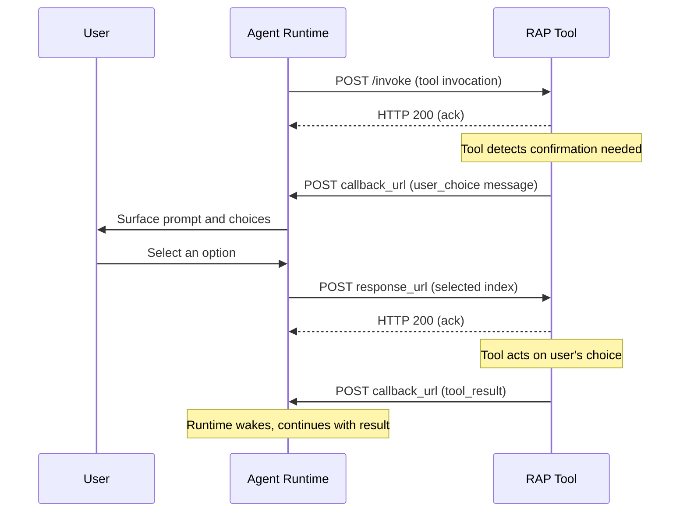

# User Choice

Tools that require user confirmation before proceeding can initiate a user choice flow by sending a `user_choice` message to the callback URL instead of a tool result. This allows tools to request a selection from the user among several options (granting a permission, choosing a deployment target, or confirming a destructive action) without the runtime needing to understand the decision logic.

## User Choice Message

When a tool determines that user confirmation is required, it MUST send a `user_choice` message to the `callback_url`:

```http
POST https://agent.example.com/callback
Content-Type: application/json

{
  "type": "user_choice",
  "group_id": "thread_xyz",
  "id": "call_abc123",
  "call_id": null,
  "prompt": "Allow writing to the original directory?",
  "choices": ["Yes for session", "Yes once", "No"],
  "default": 2,
  "response_url": "http://tool-server:PORT/user_choice_response"
}
```

### Fields

| Field | Type | Required | Description |
|---|---|---|---|
| `type` | `string` | Yes | MUST be `"user_choice"`. |
| `group_id` | `string` | Yes | Conversation thread identifier. MUST match the `group_id` from the original invocation. |
| `id` | `string` | Yes | Tool call identifier. MUST match the `id` from the original invocation. |
| `call_id` | `string \| null` | No | Secondary call identifier. If the original invocation included a `call_id`, it MUST be echoed here. |
| `prompt` | `string` | Yes | A human-readable prompt describing what the user is being asked. |
| `choices` | `string[]` | Yes | An array of human-readable labels for the available options. MUST contain at least one element. |
| `default` | `number` | Yes | Zero-based index into the `choices` array indicating the default selection. Used when the user dismisses the prompt without making an explicit choice. MUST be a valid index. |
| `response_url` | `string` | Yes | The URL where the runtime MUST POST the user's selection. |

## User Choice Response

After the user makes a selection (or dismisses the prompt), the runtime MUST POST the result to the `response_url`:

```http
POST http://tool-server:PORT/user_choice_response
Content-Type: application/json

{
  "id": "call_abc123",
  "selected": 0
}
```

### Response Fields

| Field | Type | Required | Description |
|---|---|---|---|
| `id` | `string` | Yes | Tool call identifier. MUST match the `id` from the original `user_choice` message. |
| `selected` | `number` | Yes | Zero-based index into the original `choices` array indicating the user's selection. |

## Flow

The user choice flow bridges the gap between a tool that needs confirmation and a user who can grant it, without the runtime needing to understand the decision being made.



The flow begins when the runtime dispatches a normal [tool invocation](/docs/rap/spec/basic/tool-invocation). The tool acknowledges immediately, then determines that user confirmation is required before proceeding. The tool sends a `user_choice` message containing the prompt, available choices, a default selection, and a response URL.

The runtime surfaces the choices to the user through whatever interface it provides: a picker in a CLI, a dropdown in a web UI, a button group in Slack. The user selects an option or dismisses the prompt (in which case the default is used). The runtime POSTs the selection to the response URL.

The tool receives the selection, acts accordingly, and delivers a normal [tool result](/docs/rap/spec/basic/tool-result) to the callback URL. From the runtime's perspective, the tool call simply took longer than usual; the user choice detour is transparent to the LLM.

## Runtime Behavior

The runtime MUST treat the `user_choice` message as a special callback that requires user interaction before the tool call can complete. Upon receiving a `user_choice` message, the runtime MUST surface the `prompt` and `choices` to the user in a way that allows them to make a selection.

The runtime MUST keep the original tool call in a pending state until a `tool_result` eventually arrives from the tool. When the user makes a selection or dismisses the prompt, the runtime MUST POST the selection to the `response_url`. If the user dismisses without choosing, the runtime MUST send the `default` index as the selection.

The runtime MUST NOT retry the tool invocation itself; the tool is responsible for completing the operation after receiving the user's choice.

## Tool Requirements

Tools that implement user choice MUST detect when confirmation is required before attempting the operation. The `choices` array MUST contain at least one element, and the `default` index MUST be a valid index into the array. The `response_url` MUST point to an endpoint the tool controls that can receive the selection response.

After receiving the user's selection via the response URL, the tool MUST complete the original operation (or decline it, depending on the choice) and MUST send a `tool_result` to the callback URL. Tools MUST NOT leave the tool call in a permanently pending state: every invocation MUST eventually produce a `tool_result`.

Tools are responsible for persisting any long-term decisions in their own storage. For example, if a user selects "Yes for session", the tool SHOULD store that decision in its metadata so that subsequent invocations for the same session do not prompt again.

## Error Handling

If the user choice flow fails (the runtime cannot reach the response URL, or the tool receives an invalid selection), the tool MUST send a `tool_result` with an error description:

```json
{
  "type": "tool_result",
  "group_id": "thread_xyz",
  "id": "call_abc123",
  "text": "Error: User choice flow failed. Please try again."
}
```

## Security Considerations

The `response_url` SHOULD use localhost or an internal network address when the tool server runs locally, to prevent external interception of user choices. Runtimes MUST NOT cache or replay user choice responses beyond the immediate interaction. Choice labels MUST be human-readable and MUST NOT be misleading about the action they authorize. Tools SHOULD request the minimum necessary permission scope through their choice options.
