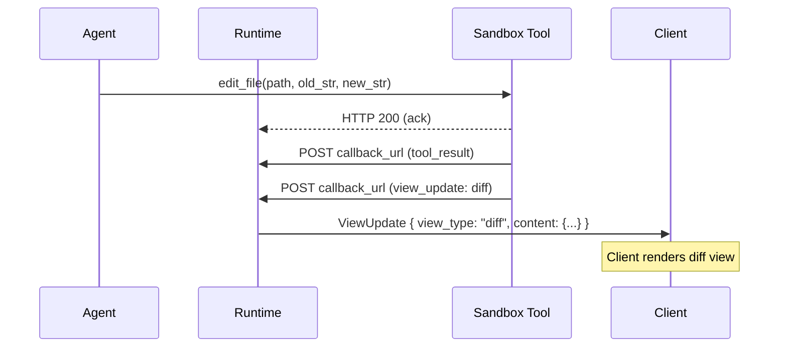

# View Updates

View updates allow tools to push structured UI state to connected clients through the runtime. This enables tools to maintain live, named "views" (such as a diff view showing the current state of sandbox changes) that clients can render alongside the conversation without embedding the data in chat history.

## View Update Message

When a tool wants to update a view, it MUST POST a `view_update` message to the `callback_url`:

```http
POST https://agent.example.com/callback
Content-Type: application/json

{
  "type": "view_update",
  "group_id": "thread_xyz",
  "view_type": "diff",
  "content": {
    "patch": "diff --git a/src/main.rs b/src/main.rs\n..."
  }
}
```

### Fields

| Field | Type | Required | Description |
|---|---|---|---|
| `type` | `string` | Yes | MUST be `"view_update"`. |
| `group_id` | `string` | Yes | Conversation thread identifier. MUST match the `group_id` from the original invocation. |
| `view_type` | `string` | Yes | Identifier for the kind of view being updated (e.g. `"diff"`). Clients use this to determine how to render the content. |
| `content` | `object` | Yes | Arbitrary JSON payload whose schema depends on the `view_type`. The runtime does not interpret this value; it stores and forwards it to clients as-is. |

### Response

The callback endpoint SHOULD return HTTP 200 on successful receipt. The tool does not need to interpret the response body.

## Runtime Behavior

The runtime MUST store the latest view state per `view_type` per thread. When a `view_update` arrives, the runtime MUST overwrite any previously stored content for that `(thread_id, view_type)` pair and broadcast the update to all connected clients viewing that thread.

When a client connects to a thread, the runtime MUST include all active views for that thread in the initial replay so the client can render the current state immediately.

The runtime MUST NOT interpret the `content` field. It acts as a pass-through, storing and forwarding the value exactly as received from the tool. This decoupling allows tools to define new view types without requiring runtime changes.

## Client Behavior

Clients SHOULD render views they recognize and SHOULD silently ignore view types they do not support. When multiple views are active, clients MAY provide a navigation mechanism (e.g. tabs or pills) to switch between the conversation and available views.

Clients SHOULD update their rendered view immediately when a new `view_update` arrives for a view type they are currently displaying.

## Example: Diff View

A sandbox tool server can push an overall diff view after each file modification:



The `content` for a `"diff"` view type contains a unified diff patch:

```json
{
  "type": "view_update",
  "group_id": "thread_xyz",
  "view_type": "diff",
  "content": {
    "patch": "diff --git a/src/main.rs b/src/main.rs\nindex abc..def 100644\n--- a/src/main.rs\n+++ b/src/main.rs\n@@ -1,3 +1,4 @@\n fn main() {\n+    println!(\"hello\");\n }"
  }
}
```

## Tool Requirements

Tools that send view updates MUST include a valid `group_id` matching the thread context of the operation that produced the view data. Tools SHOULD send view updates after operations that change the view state, for example after file edits, command execution, or sandbox squash operations.

Tools MUST NOT send view updates for view types that have no meaningful content. If a view becomes empty (e.g. all changes are reverted), the tool SHOULD send a view update with empty content to signal that the view should be cleared.

## Security Considerations

View content is rendered by clients and MUST be treated as untrusted input. Clients MUST sanitize view content before rendering to prevent injection attacks. Runtimes MUST validate that incoming `view_update` messages reference a known thread before storing and broadcasting them.
