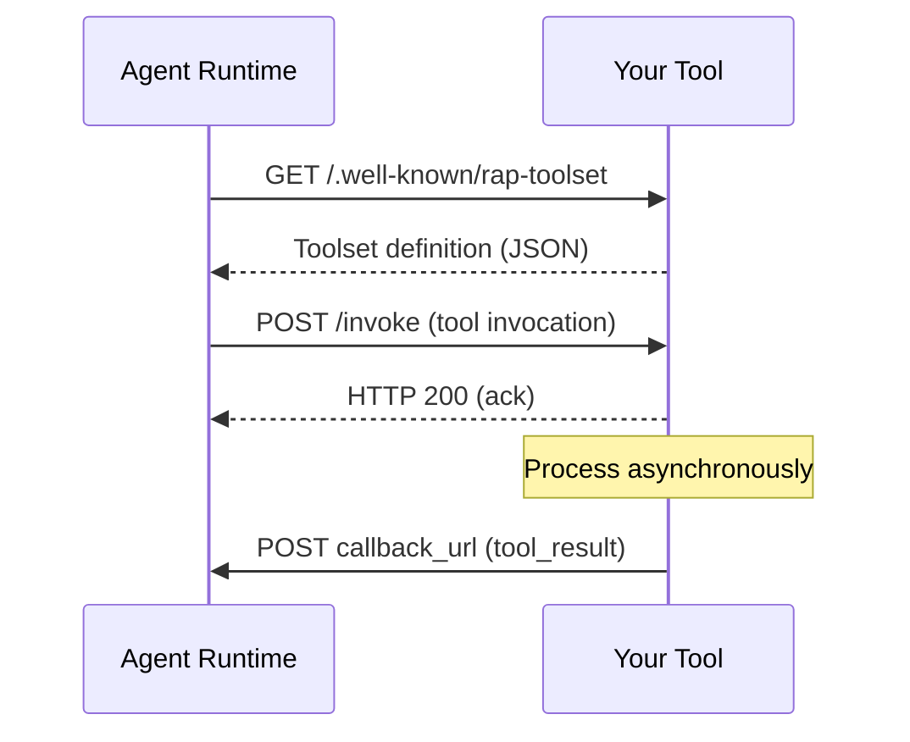

# Building a RAP Server

A RAP server is an HTTP service that does three things: serves a [toolset definition](/spec/basic/toolsets) so runtimes can discover it, accepts [tool invocations](/spec/basic/tool-invocation) and acknowledges them immediately, and delivers [tool results](/spec/basic/tool-result) asynchronously to a callback URL. You can build one in any language on any platform — the only requirement is HTTP.

## RAP Server Architecture

Your server is a single HTTP endpoint that handles two kinds of requests:

- **GET `/.well-known/rap-toolset`** — Return your toolset definition (discovery)
- **POST to your endpoint** — Receive a tool invocation, acknowledge it, process it, and POST the result back



The runtime never waits for your tool to finish. It dispatches the invocation, gets the HTTP 200 acknowledgement, persists its state, and exits. Your tool does its work on its own schedule and delivers the result whenever it's ready — milliseconds or days later.

## Defining a toolset

The toolset definition tells runtimes what operations your tool supports. It's a JSON object served at `/.well-known/rap-toolset` relative to your endpoint base URL. See the [Toolsets spec](/spec/basic/toolsets) for the full schema.

```javascript
const TOOLSET_MANIFEST = {
  name: 'weather-tools',
  description: 'Current weather data and forecasts',
  endpoint: 'https://weather-tool.example.com',
  tools: [
    {
      name: 'get_weather',
      description: 'Get current weather conditions for a location',
      inputSchema: {
        type: 'object',
        properties: {
          location: { type: 'string', description: 'City name or coordinates' },
          units: { type: 'string', enum: ['metric', 'imperial'], description: 'Temperature units' },
        },
        required: ['location'],
      },
      displayScript: '"Weather for " + args.location',
    },
  ],
};
```

Each tool in the array has a `name` (which becomes the `operation` field in invocations), a `description` (passed to the LLM for tool selection), and an `inputSchema` (JSON Schema for argument validation). Tool names must be unique within the toolset and should use only letters, digits, underscores, and hyphens. Tools can optionally include a [`displayScript`](/spec/basic/toolsets#display-script) — a Rhai script that produces a human-readable string for the agent frontend to show instead of the raw tool call.

### Annotations

Tools can include optional [annotations](/spec/basic/toolsets#annotations) that inform the runtime and LLM about the tool's behavior:

```javascript
{
  name: 'delete_repository',
  description: 'Permanently delete a GitHub repository',
  inputSchema: { /* ... */ },
  annotations: {
    destructive: true,    // Runtime may prompt for confirmation
    longRunning: true,    // Expected to take minutes
  },
}
```

## Handling invocations

When the runtime invokes your tool, it sends a POST with a JSON body containing the operation name, arguments, and routing information. See the [Tool Invocation spec](/spec/basic/tool-invocation) for the full field reference.

The critical requirement: **acknowledge immediately, process asynchronously**. Your HTTP response must return before you start doing real work. On Lambda, response streaming makes this straightforward — write the acknowledgement and close the stream, then continue processing in the same handler.

```javascript
import { sendToolResult } from 'rap-js';

export const handler = awslambda.streamifyResponse(async (event, responseStream) => {
  // Discovery endpoint
  if (event.requestContext?.http?.method === 'GET'
      && event.rawPath?.includes('.well-known/rap-toolset')) {
    const manifest = { ...TOOLSET_MANIFEST };
    if (!manifest.endpoint) {
      manifest.endpoint = `https://${event.requestContext?.domainName || ''}`;
    }
    responseStream.write(JSON.stringify(manifest));
    responseStream.end();
    return;
  }

  // Acknowledge the invocation immediately
  responseStream.write('OK');
  responseStream.end();

  // Now process asynchronously
  const body = typeof event.body === 'string' ? JSON.parse(event.body) : event.body;
  const { operation, arguments: args, id, call_id, callback_url, group_id } = body;

  try {
    const result = await getWeather(args.location, args.units);
    await sendToolResult(callback_url, group_id, id, call_id, JSON.stringify(result));
  } catch (error) {
    await sendToolResult(callback_url, group_id, id, call_id, `Error: ${error.message}`);
  }
});
```

The `rap-js` helper handles SigV4 signing for Lambda Function URLs. If your callback endpoint uses a different auth mechanism, you can POST directly with the [tool result format](/spec/basic/tool-result).

### The invocation payload

Your tool receives a JSON body with these fields:

| Field | Type | Description |
|---|---|---|
| `operation` | `string` | The tool name from your toolset definition |
| `arguments` | `object` | Arguments matching your tool's `inputSchema` |
| `id` | `string` | Unique call identifier — echo this in your result |
| `call_id` | `string \| null` | Secondary identifier — echo this if present |
| `callback_url` | `string` | Where to POST your result |
| `group_id` | `string` | Conversation thread — include in your result |
| `user_id` | `string \| null` | End-user identity for authorization or personalization |

## Delivering results

When your tool finishes, POST a [tool result](/spec/basic/tool-result) to the `callback_url`. The `group_id` and `id` must match the original invocation so the runtime can route the result to the correct conversation and match it to the pending tool call.

```javascript
// What sendToolResult does under the hood:
await fetch(callback_url, {
  method: 'POST',
  headers: { 'Content-Type': 'application/json' },
  body: JSON.stringify({
    type: 'tool_result',
    group_id: group_id,
    id: id,
    call_id: call_id,
    text: 'Current weather in Seattle: 62°F, partly cloudy',
  }),
});
```

The `text` field carries your result. It can be plain text or JSON-encoded structured data — the LLM receives it as-is and reasons about it in context.

### Error results

There's no separate error message type. If something goes wrong, send a normal `tool_result` with the error in `text`. Prefix errors with `"Error: "` so the LLM can distinguish them from successful results, and include actionable information (retry timing, missing permissions) so the LLM can attempt recovery.

```javascript
await sendToolResult(callback_url, group_id, id, call_id,
  'Error: API rate limit exceeded. Retry after 60 seconds.'
);
```

Every invocation must produce a result. Never silently drop an invocation — the agent will wait indefinitely for a response that never comes.

## Subscription tools

Some tools create ongoing subscriptions rather than returning a single result. A GitHub webhook listener, a stock price monitor, a Slack channel watcher — these tools deliver events over time, each one waking the agent.

The pattern: acknowledge the invocation, store the callback information durably, return a confirmation as a normal tool result, then send [`subscription_event`](/spec/server/subscription-events) messages whenever matching events occur.

```javascript
import { sendToolResult, sendSubscriptionEvent } from 'rap-js';

// Handle the initial subscription invocation
async function handleSubscribe(args, id, callId, callbackUrl, groupId) {
  // Store durably — events may arrive days later
  await db.put({
    subscriptionId: id,
    filter: args.filter,
    callbackUrl,
    groupId,
    toolCallId: id,
  });

  await sendToolResult(callbackUrl, groupId, id, callId,
    `Subscribed with filter: ${args.filter}. Subscription ID: ${id}`,
    true // subscription: true tells the runtime to track this as an active subscription
  );
}

// Called by your webhook handler when a matching event fires
async function handleEvent(subscription, eventData) {
  await sendSubscriptionEvent(
    subscription.callbackUrl,
    subscription.groupId,
    subscription.toolCallId,
    JSON.stringify(eventData)
  );
}
```

Include `subscription: true` in the [tool result](/spec/basic/tool-result) to signal to the runtime that this tool call has started a subscription. The runtime records the tool call ID as an active subscription so the agent can later cancel it via the built-in [`cancel_subscription` protocol](/spec/server/subscription-events#cancellation).

The runtime spawns a child thread for each subscription event, giving each event a clean context window. The subscription remains active until explicitly cancelled.

## Schema evolution

Runtimes cache your toolset definition for the duration of an agent session. If you deploy a breaking schema change while agents hold cached definitions, they'll send invocations with stale arguments. Your tool should handle this gracefully — either maintain backward compatibility or return a clear error via the normal tool result path. See [Loading Toolsets](/spec/basic/toolsets#loading-toolsets) for details on caching behavior.

## CDK integration

If you're using the Infinity Runtime, the `RapToolSet` construct connects your tool server to the agent. You don't declare tool names, descriptions, or schemas in CDK — the runtime discovers those from your tool's `/.well-known/rap-toolset` endpoint at startup. CDK just handles the infrastructure wiring.

For a Lambda-based tool server, pass the handler function directly. The construct creates a Function URL with IAM auth and response streaming, grants the runtime permission to invoke it, and grants the tool permission to POST results back:

```typescript
const weatherFunction = new lambda.Function(this, 'WeatherTool', {
  runtime: lambda.Runtime.NODEJS_24_X,
  handler: 'index.handler',
  code: lambda.Code.fromAsset(path.join(__dirname, 'weather-tool')),
  timeout: cdk.Duration.seconds(30),
});

new RapToolSet(agent, 'WeatherTools', {
  handler: weatherFunction,
});
```

Your Lambda serves both the discovery endpoint and the invocation endpoint on the same Function URL — the handler distinguishes between GET requests for `/.well-known/rap-toolset` and POST requests for invocations, as shown in the [handler example above](#handling-invocations).

For tool servers hosted outside of your CDK stack (another account, a third-party service, a container), pass the base URL directly:

```typescript
new RapToolSet(agent, 'ExternalTools', {
  serverUrl: 'https://tools.example.com',
});
```

The runtime will fetch the toolset definition from `https://tools.example.com/.well-known/rap-toolset` and dispatch invocations to whatever `endpoint` the toolset declares.


## Local development

You can develop and test RAP tools locally using the [Infinity Code CLI](/docs/infinity-code/overview) without deploying any infrastructure. Write your tool as a plain Node.js (or any language) HTTP server:

```javascript
import { createServer } from 'node:http';

const server = createServer(async (req, res) => {
  if (req.method === 'GET' && req.url?.includes('.well-known/rap-toolset')) {
    res.writeHead(200, { 'Content-Type': 'application/json' });
    res.end(JSON.stringify({
      name: 'my-tool',
      endpoint: `http://${req.headers.host}`,
      tools: [{ name: 'do_thing', description: '...', inputSchema: { type: 'object' } }],
    }));
    return;
  }

  // Acknowledge immediately
  res.writeHead(200);
  res.end('OK');

  // Read body, process, POST result back to callback_url
  const chunks = [];
  for await (const chunk of req) chunks.push(chunk);
  const { arguments: args, id, call_id, callback_url, group_id } = JSON.parse(Buffer.concat(chunks));

  await fetch(callback_url, {
    method: 'POST',
    headers: { 'Content-Type': 'application/json' },
    body: JSON.stringify({ type: 'tool_result', group_id, id, call_id, text: 'Done!' }),
  });
});

server.listen(3001, '127.0.0.1');
```

Point the CLI at your server with a `rap-servers.json` config file:

```json
{
  "tool_sets": [
    { "type": "toolset_server", "server_url": "http://127.0.0.1:3001" }
  ]
}
```

The `get-time` tool includes a ready-to-run local server at `agent/lib/toolsets/get-time/get-time-tool/local.mjs`, which you can use as a reference when building local RAP tools.
