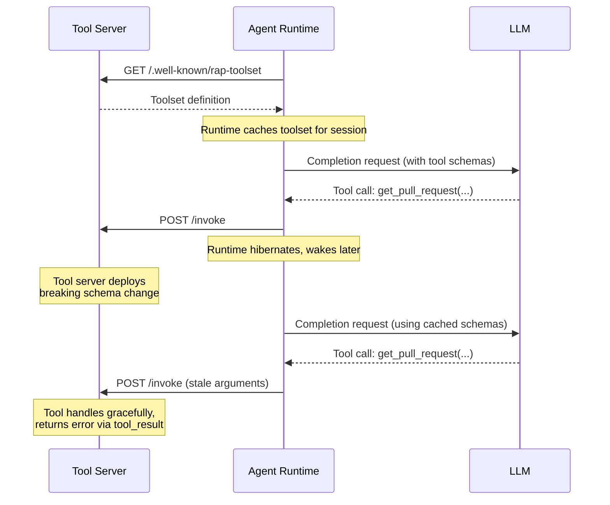

# Toolsets

The Reactive Agent Protocol (RAP) allows tool servers to expose operations that can be invoked by agent runtimes on behalf of an LLM. Tools are organized into **toolsets** — declarative JSON manifests that describe the operations a tool server exposes, how to reach it, and what arguments each operation expects.

Toolsets serve as the contract between tool authors and runtime implementors. The runtime loads toolset definitions at startup, passes the tool schemas to the LLM so it knows what operations are available, and uses the endpoint information to dispatch invocations correctly. Each tool within a toolset is uniquely identified by a name and includes a JSON Schema describing its expected input.

## Toolset Definition

A toolset MUST be a JSON object with the following top-level fields:

```json
{
  "name": "github-tools",
  "description": "GitHub repository management and event subscription tools",
  "endpoint": "https://tool.example.com/invoke",
  "tools": [...]
}
```

| Field | Type | Required | Description |
|---|---|---|---|
| `name` | `string` | Yes | Unique identifier for the toolset. MUST be between 1 and 128 characters. |
| `description` | `string` | No | Human-readable description of the toolset's purpose. |
| `endpoint` | `string` | Yes | The HTTP endpoint URL where the runtime MUST send [tool invocations](/spec/basic/tool-invocation) for this toolset's operations. |
| `tools` | `array` | Yes | Array of [tool definitions](#tool-definition). MUST contain at least one tool. |

## Tool Definition

Each entry in the `tools` array describes a single operation that the LLM can invoke. The tool's `name` becomes the `operation` field in [tool invocations](/spec/basic/tool-invocation), and its `description` is passed to the LLM to inform tool selection. The `inputSchema` defines the expected arguments using JSON Schema, which the runtime SHOULD validate before dispatching.

```json
{
  "name": "get_pull_request",
  "description": "Get details of a specific pull request",
  "inputSchema": {
    "type": "object",
    "properties": {
      "owner": { "type": "string", "description": "Repository owner" },
      "repo": { "type": "string", "description": "Repository name" },
      "number": { "type": "integer", "description": "Pull request number" }
    },
    "required": ["owner", "repo", "number"]
  }
}
```

| Field | Type | Required | Description |
|---|---|---|---|
| `name` | `string` | Yes | Unique operation name within the toolset. This value is sent as the `operation` field in [tool invocations](/spec/basic/tool-invocation). |
| `description` | `string` | Yes | Human-readable description of what the tool does. This is passed to the LLM for tool selection. |
| `inputSchema` | `object` | Yes | JSON Schema defining the expected `arguments` for this tool. MUST be a valid JSON Schema object. |
| `annotations` | `object` | No | Optional metadata describing tool behavior. See [Annotations](#annotations). |

### Tool Names

Tool names MUST be between 1 and 128 characters in length and MUST be unique within a toolset. Names SHOULD contain only ASCII letters (`A-Z`, `a-z`), digits (`0-9`), underscores (`_`), and hyphens (`-`). They MUST NOT contain spaces or special characters, and SHOULD be treated as case-sensitive by both runtimes and tools.

Example valid tool names: `get_pull_request`, `subscribe_github_events`, `deploy-service`, `RunPipeline`.

### Input Schema

The `inputSchema` field MUST be a valid JSON Schema object that describes the expected arguments for the tool. The schema SHOULD use JSON Schema draft 2020-12 by default, though implementations MAY specify an explicit `$schema` field to use a different draft. The runtime SHOULD validate invocation arguments against this schema before dispatching the request to the tool.

For tools that accept no parameters, the schema SHOULD explicitly indicate that only empty objects are accepted:

```json
{
  "name": "get_current_time",
  "description": "Returns the current server time in ISO 8601 format",
  "inputSchema": { "type": "object", "additionalProperties": false }
}
```

### Annotations

Tools MAY include an `annotations` object that provides metadata about their behavior. Annotations are informational — they help runtimes and LLMs make better decisions about when and how to invoke a tool, but they do not change the protocol mechanics. For example, a runtime might use the `destructive` annotation to prompt for user confirmation, or use `subscription` to adjust how it handles the tool's result lifecycle.

| Annotation | Type | Description |
|---|---|---|
| `subscription` | `boolean` | If `true`, indicates this tool creates an ongoing [subscription](/spec/server/subscription-events) rather than returning a single result. |
| `requiresAuth` | `string` | Identifier for the authentication provider this tool requires. Indicates the tool may initiate an [OAuth flow](/spec/server/oauth). |
| `readOnly` | `boolean` | If `true`, indicates this tool performs only read operations and does not modify external state. |
| `destructive` | `boolean` | If `true`, indicates this tool performs destructive operations (e.g., deleting resources). Runtimes SHOULD prompt for user confirmation. |
| `idempotent` | `boolean` | If `true`, indicates the tool can be safely retried without side effects. |
| `longRunning` | `boolean` | If `true`, indicates the tool is expected to take significant time (minutes or hours) to complete. |

Implementations MAY define additional custom annotations. Custom annotation keys SHOULD use a namespaced format (e.g., `x-mycompany-priority`) to avoid conflicts with future protocol-defined annotations.

## Loading Toolsets

Runtimes MUST load toolset definitions by fetching them from the tool server's well-known discovery endpoint. The runtime MUST NOT load toolset definitions from local files, inline configuration, or any other source. This ensures that the runtime always obtains the authoritative definition directly from the tool server.

Because RAP runtimes are ephemeral and may cache toolset definitions across invocations within a session, there can be a significant delay between when a toolset was fetched and when the LLM actually invokes one of its tools. Tool implementors MUST account for this gap — a tool server that deploys breaking changes to its schema while agents hold cached definitions will receive invocations with stale arguments. Tool servers SHOULD handle such invocations gracefully by returning an error via the normal [tool result](/spec/basic/tool-result) path rather than failing silently.



Runtimes SHOULD support loading multiple toolsets simultaneously. When multiple toolsets are loaded, tool names MUST be unique across all loaded toolsets — if two toolsets define a tool with the same name, the runtime MUST report an error and MUST NOT make either tool available. The runtime MUST resolve the correct endpoint for each tool based on its parent toolset's `endpoint` field.

### Discovery Endpoint

Tool servers MUST expose a well-known discovery endpoint that returns the current toolset definition. This is the sole mechanism by which runtimes obtain toolset definitions.

```http
GET https://tool.example.com/.well-known/rap-toolset
Accept: application/json
```

The server MUST respond with the full toolset JSON:

```http
HTTP/1.1 200 OK
Content-Type: application/json

{
  "name": "github-tools",
  "endpoint": "https://tool.example.com/invoke",
  "tools": [...]
}
```

The discovery URL MUST follow the pattern `{endpoint_base}/.well-known/rap-toolset`. Runtimes are configured with a list of tool server base URLs and MUST append `/.well-known/rap-toolset` to each to fetch the toolset definition.

### Caching

Runtimes SHOULD cache toolset definitions for the duration of the agent session (i.e., the root conversation thread). New sessions MUST always fetch fresh toolset definitions from the discovery endpoint, ensuring that newly created agents always start with the latest tool schemas. Within a session, the runtime SHOULD reuse the cached definition for all subsequent invocations without re-fetching.

## Validation

Runtimes MUST validate toolset definitions when loading them. The `name` field MUST be present and non-empty, and the `endpoint` field MUST be a valid URL. The `tools` array MUST contain at least one tool, and each tool MUST have a valid `name`, `description`, and `inputSchema` where the `inputSchema` is a valid JSON Schema object.

If validation fails, the runtime MUST report the error and MUST NOT make the invalid toolset's tools available to the LLM. Partial loading — where some tools from an invalid toolset are made available — is not permitted.

## Security Considerations

Toolset definitions SHOULD be loaded from trusted sources only. Runtimes SHOULD verify the integrity of remotely-loaded toolset definitions — for example, via checksums, digital signatures, or pinned URLs — to prevent tampering.

Tool descriptions are passed directly to the LLM and SHOULD be treated as untrusted input. They MUST NOT be used to execute code or modify runtime behavior beyond informing the LLM's tool selection.
