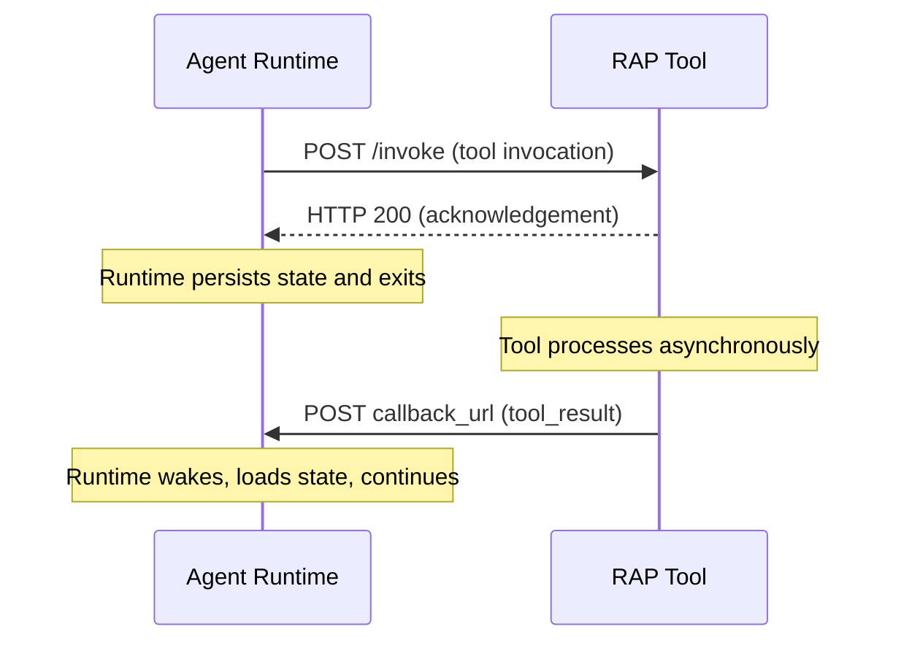

# RAP Specification

The Reactive Agent Protocol (RAP) is an open protocol that enables asynchronous, event-driven communication between AI agent runtimes and external tools. Whether you're building long-running agents, reacting to webhooks, or orchestrating multi-step workflows that span hours or days, RAP provides a standardized way to connect agents with tools that operate on their own schedule.

This specification defines the authoritative protocol requirements for RAP. For implementation guides and examples, visit the [Documentation](/docs/what-is-rap).

The key words "MUST", "MUST NOT", "REQUIRED", "SHALL", "SHALL NOT", "SHOULD", "SHOULD NOT", "RECOMMENDED", "NOT RECOMMENDED", "MAY", and "OPTIONAL" in this document are to be interpreted as described in BCP 14 [RFC 2119](https://www.rfc-editor.org/rfc/rfc2119) [RFC 8174](https://www.rfc-editor.org/rfc/rfc8174) when, and only when, they appear in all capitals, as shown here.

## Overview

RAP provides a standardized way for applications to invoke tools asynchronously via HTTP without blocking the agent process, receive tool results and event notifications through a unified callback mechanism, hibernate agent runtimes between tool calls at zero compute cost, and subscribe to ongoing external events that wake the agent on demand. Together, these capabilities enable agents that can run indefinitely — reacting to webhooks, waiting for CI pipelines, and monitoring data feeds — while paying only for the compute they actually use.

The protocol defines HTTP message contracts between two roles:

- **Runtimes**: Agent host processes that orchestrate LLM completions and tool dispatch
- **Tools**: Independent HTTP services that receive invocations and return results asynchronously

RAP takes inspiration from the [Model Context Protocol](https://modelcontextprotocol.io), which standardizes how to integrate tools and context into AI applications. RAP extends this model to support asynchronous execution, long-running operations, and event-driven subscriptions — capabilities that require the agent to release compute while waiting.

## Key Details

This section summarizes the core protocol mechanics. Each topic is covered in full detail in its own specification page.

### Transport

RAP uses HTTP as its sole transport mechanism. The runtime communicates with tools by sending HTTP POST requests to the tool's registered endpoint, and tools communicate back by POSTing to a callback URL provided in the original invocation. All messages are JSON-encoded with `Content-Type: application/json` and MUST be UTF-8 encoded.

Unlike request-response protocols, RAP uses a fire-and-forget invocation model: the runtime dispatches a tool call, the tool acknowledges immediately with HTTP 200, and the runtime persists state and exits. The tool processes the request asynchronously and delivers the result to the callback URL when ready. This decoupling is what enables the runtime to hibernate between tool calls. See [Transport](/spec/basic/transport) for the full specification.

### Protocol Roles

The protocol defines two roles that communicate through the HTTP message contracts described above.

**Runtimes** are the agent host processes that orchestrate LLM completions and tool dispatch. On each invocation, the runtime provides tools with the context they need to operate and deliver results:

- **Callback URL**: An HTTP endpoint where tools POST results, events, and authorization requests. The runtime generates this URL and includes it in every tool invocation so that tools can return results asynchronously without knowing the runtime's internal architecture.
- **Group ID**: A conversation thread identifier that tools MUST include in all callback messages. The runtime uses this to route incoming messages to the correct conversation context.
- **User ID**: An optional end-user identity that tools MAY use for authorization decisions, personalization, or audit logging.
- **Thread closure notifications**: A best-effort signal sent to tool servers when a conversation thread is closed, allowing them to clean up thread-specific resources. See [Thread Closure](/spec/basic/thread-closure).
- **Tool cancellation notifications**: A best-effort signal sent to tool servers when a tool call is interrupted, allowing them to abort in-flight operations. See [Tool Cancellation](/spec/basic/tool-cancellation).

**Tools** are independent HTTP services that receive invocations, process them on their own schedule, and return results through the callback mechanism. Tools provide the following capabilities to runtimes:

- **Tool definitions**: JSON Schema descriptions of available operations, organized into [toolsets](/spec/basic/toolsets). The runtime loads these definitions and passes them to the LLM so it knows what tools are available and how to call them.
- **Tool results**: Asynchronous responses delivered to the callback URL when an operation completes. See [Tool Result](/spec/basic/tool-result).
- **Subscription events**: Ongoing event notifications from active subscriptions, delivered to the callback URL each time a matching external event occurs. See [Subscription Events](/spec/server/subscription-events).
- **OAuth requests**: Authorization flow initiation when a tool requires user consent to access an external service. See [OAuth](/spec/server/oauth).
- **User choice requests**: Confirmation flow initiation when a tool requires the user to select among several options before proceeding. See [User Choice](/spec/server/user-choice).

### Message Types

The protocol defines four message types that cover the full range of communication between runtimes and tools. Tool invocations flow from runtime to tool, while the remaining three message types flow from tool to runtime through the callback URL.

| Message | Direction | Description |
|---|---|---|
| [Tool Invocation](/spec/basic/tool-invocation) | Runtime → Tool | Invoke a tool operation. Contains the operation name, arguments, callback URL, and routing identifiers. |
| [Tool Result](/spec/basic/tool-result) | Tool → Runtime | Return the result of a completed operation. Contains the result text and the identifiers needed to match it to the original invocation. |
| [Subscription Event](/spec/server/subscription-events) | Tool → Runtime | Deliver an event from an active subscription. References the original subscription tool call so the runtime can associate the event with the correct context. |
| [OAuth](/spec/server/oauth) | Tool → Runtime | Initiate a user authorization flow. Contains an authorization URL that the runtime surfaces to the user. The tool retries the original operation after authorization completes. |
| [User Choice](/spec/server/user-choice) | Tool → Runtime | Request a choice from the user among several options. Contains a prompt, choices array, and response URL. The tool acts on the selection and returns a normal tool result. |

### Toolset Definition

Tools are organized into **toolsets** — declarative JSON manifests that describe the operations a tool server exposes. A toolset includes the tool server's endpoint URL and an array of tool definitions, each with a name, description, and JSON Schema for its input arguments.

Runtimes load toolset definitions at startup to discover available tools, validate invocation arguments at dispatch time, and pass tool schemas to the LLM on each completion request. Toolsets are fetched from the tool server's well-known discovery endpoint and MAY be cached within an agent session. See [Toolsets](/spec/basic/toolsets) for the full specification.

## Security and Trust

RAP enables powerful capabilities through arbitrary HTTP communication and asynchronous code execution. Because tools operate independently and can take arbitrarily long to return results, the attack surface extends beyond a single request-response cycle. All implementors MUST carefully address the following considerations.

### Key Principles

**User Consent and Control.** Users MUST explicitly consent to and understand all tool operations before they are dispatched. Because RAP tools can perform long-running and potentially irreversible actions — deploying infrastructure, modifying repositories, sending messages on behalf of the user — runtimes MUST ensure that users retain control over what data is shared and what actions are taken. Implementors SHOULD provide clear interfaces for reviewing and authorizing tool invocations, especially for tools annotated as `destructive`.

**Data Privacy.** Runtimes MUST NOT expose user data to tools without explicit user consent. Tools MUST NOT store or transmit user data beyond what is required for the requested operation. Because callback URLs can persist for the lifetime of a subscription, they SHOULD be scoped and short-lived where possible to limit the window of exposure if a URL is compromised.

**Tool Safety.** Tools represent arbitrary code execution and MUST be treated with appropriate caution. Tool descriptions and annotations are provided by the tool author and SHOULD be treated as untrusted input — they MUST NOT be used to execute code or modify runtime behavior. Runtimes SHOULD validate tool results before passing them to the LLM, and subscription events SHOULD be validated against the expected subscription before processing.

**Authentication.** The authentication mechanism between runtime and tool is implementation-specific. The protocol does not mandate a particular scheme, but implementations SHOULD use established authentication mechanisms such as AWS SigV4, bearer tokens, or mutual TLS. Callback URLs are particularly sensitive because they accept messages that wake the runtime and inject content into conversations — they SHOULD be authenticated to prevent unauthorized message injection.

### Implementation Guidelines

While RAP itself cannot enforce these security principles at the protocol level, implementors SHOULD:

- Build robust consent and authorization flows into their applications, with particular attention to destructive and long-running operations
- Provide clear documentation of security implications for each tool and toolset
- Implement appropriate access controls and data protections, including rate limiting on both invocation and callback endpoints
- Follow security best practices in their integrations, including HTTPS for all production communication
- Consider privacy implications in their feature designs, especially for subscription tools that persist callback URLs over extended periods
- Validate all incoming messages against the expected schema and reject malformed payloads

## Learn More

Explore the detailed specification for each protocol component:

- **Basic Protocol**
  - [Lifecycle](/spec/basic/lifecycle) — Runtime execution model and hibernation
  - [Transport](/spec/basic/transport) — HTTP message format and delivery
  - [Tool Invocation](/spec/basic/tool-invocation) — Invoking tools from the runtime
  - [Tool Result](/spec/basic/tool-result) — Returning results from tools
  - [Toolsets](/spec/basic/toolsets) — Declaring and discovering tool definitions
  - [Thread Closure](/spec/basic/thread-closure) — Best-effort thread cleanup notifications
  - [Tool Cancellation](/spec/basic/tool-cancellation) — Best-effort tool call cancellation notifications

- **Server Features**
  - [Subscription Events](/spec/server/subscription-events) — Event-driven subscriptions
  - [OAuth](/spec/server/oauth) — User authorization flows
  - [User Choice](/spec/server/user-choice) — User confirmation flows
