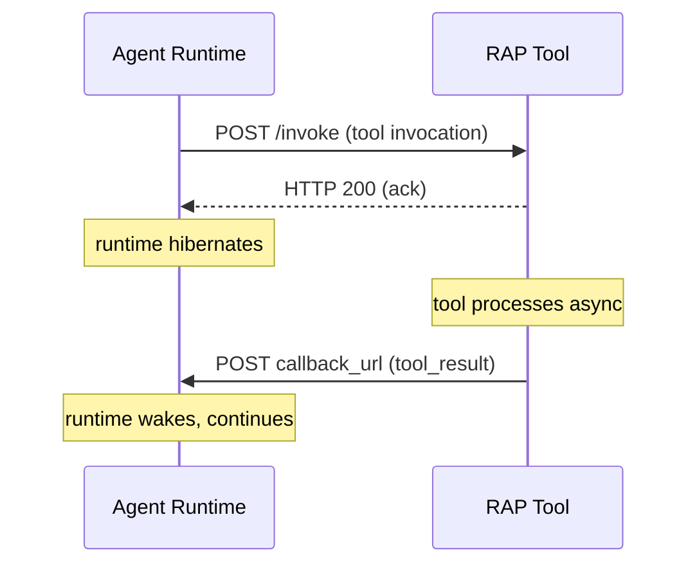

# RAP Specification

This section defines the public protocol between RAP agent runtimes and tools — the HTTP contracts that both sides must implement.

The protocol has two directions of communication:

**Runtime → Tool.** The runtime invokes a tool by POSTing a JSON payload to the tool's HTTP endpoint. The tool must acknowledge immediately with HTTP 200.

**Tool → Runtime.** The tool returns results by POSTing a JSON payload to the `callback_url` provided in the original invocation. Three message types are supported: `tool_result`, `subscription_event`, and `oauth`.

Everything else — how the runtime stores conversation state, how it runs the LLM, how it serializes messages internally — is implementation-specific and not part of this specification.
