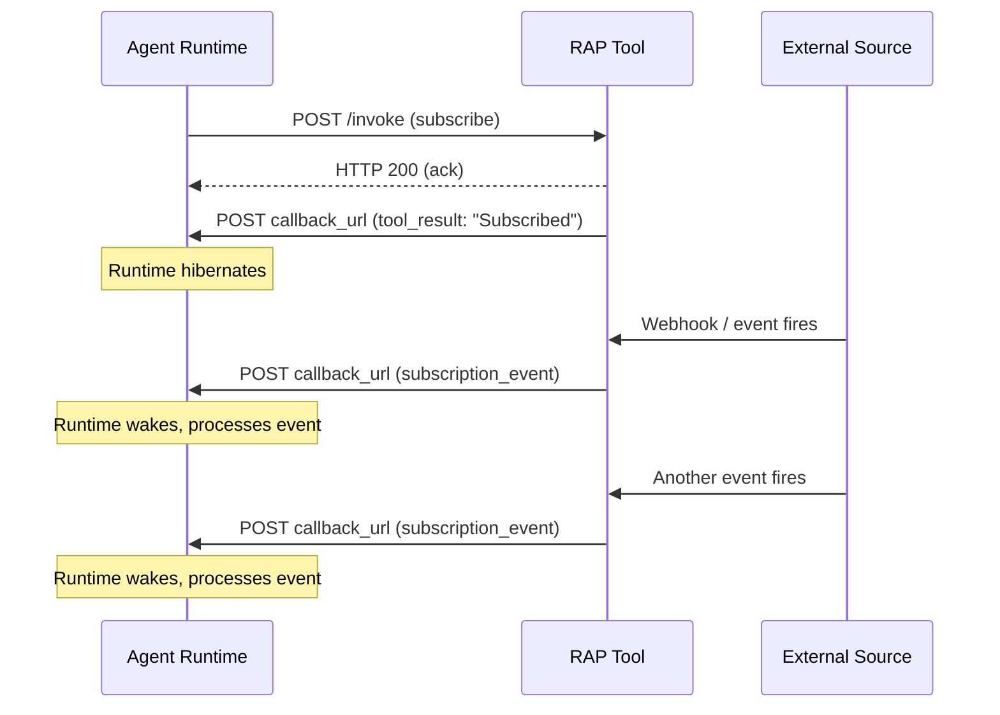
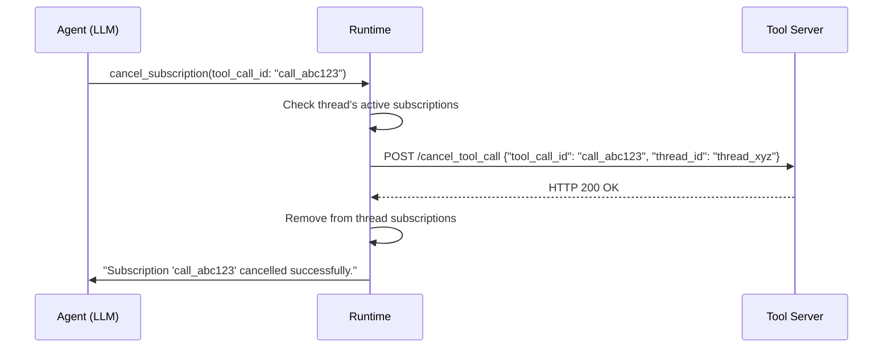

# Subscription Events

Subscription events allow tools to send multiple results over time for a single tool call. This is how RAP agents react to external events — webhooks, price changes, monitoring alerts — without polling. A subscription persists across runtime hibernations, waking the agent each time a matching event occurs.

## Lifecycle

1. The runtime invokes a subscription tool with a normal [tool invocation](/spec/basic/tool-invocation)
2. The tool stores the `callback_url`, `group_id`, and `id` from the invocation
3. The tool returns a confirmation as a normal [`tool_result`](/spec/basic/tool-result)
4. When a matching event occurs (now or in the future), the tool POSTs a `subscription_event` to the stored `callback_url`
5. The runtime processes the event (typically by injecting a synthetic tool call into conversation history)
6. Steps 4–5 repeat for each matching event until the subscription is cancelled



## Notification Message

When a matching event occurs, the tool MUST POST a `subscription_event` to the stored `callback_url`:

```http
POST https://agent.example.com/callback
Content-Type: application/json

{
  "type": "subscription_event",
  "group_id": "thread_xyz",
  "tool_call_id": "call_abc123",
  "text": "{\"event_type\": \"pull_request\", \"action\": \"opened\", \"number\": 42}"
}
```

An associative subscription event is injected inline into the subscribing thread rather than spawning a child thread:

```http
POST https://agent.example.com/callback
Content-Type: application/json

{
  "type": "subscription_event",
  "group_id": "thread_xyz",
  "tool_call_id": "call_abc123",
  "text": "build output line 1\nbuild output line 2\n[exit code: 0]",
  "associative": true
}
```

### Fields

| Field | Type | Required | Description |
|---|---|---|---|
| `type` | `string` | Yes | MUST be `"subscription_event"`. |
| `group_id` | `string` | Yes | Conversation thread identifier. MUST match the `group_id` from the original subscription invocation. |
| `tool_call_id` | `string` | Yes | The tool call `id` from the original invocation that created the subscription. |
| `text` | `string` | Yes | Event payload. SHOULD be JSON-encoded for structured event data. |
| `associative` | `boolean` | No | When `true`, the runtime SHOULD inject the event inline into the subscribing thread's history rather than spawning a child thread. Defaults to `false`. See [Processing Strategies](#processing-strategies). |

:::note
Subscription events use `tool_call_id` (referencing the original subscription call), while [tool results](/spec/basic/tool-result) use `id`. This distinction tells the runtime that the message is a new event from an ongoing subscription, not the final result of a one-off call.
:::

### Response

The callback endpoint SHOULD return HTTP 200 on successful receipt. The tool does not need to interpret the response body.

## Synthetic Tool Calls

When a subscription event arrives, the runtime needs to present it to the LLM in a way that makes sense in the conversation. The original subscription tool call already has a result (the confirmation message). The runtime MUST NOT append a second result to the same tool call.

Instead, the runtime SHOULD inject a **synthetic tool call** into conversation history:

1. Look up the original subscription tool call using the `tool_call_id`
2. Create a synthetic assistant message that echoes the original tool call, annotated with `kind: "interrupt"` to signal that this is an event notification
3. Append the event content as the tool result for this synthetic call

The LLM sees what appears to be a natural tool call / result pair:

```
[assistant tool_call] subscribe_github_events({
  owner: "acme",
  repo: "api",
  kind: "interrupt:call_abc123 (subscription remains active)"
})
[tool_result] {"event_type": "pull_request", "action": "opened", "number": 42}
```

The `kind` annotation tells the LLM that this is an event from an existing subscription, not a new subscription request.

### Processing Strategies

Runtimes MAY use either of two strategies for processing subscription events. The `associative` field on the event controls which strategy the runtime SHOULD use.

**Inline (associative) processing.** When `associative` is `true`, the synthetic call is appended directly to the subscribing thread's history. The LLM sees the event in its main conversation context. This is appropriate for events that are incremental updates to an ongoing operation — for example, streaming command output or build progress — where each event is closely tied to the originating tool call and the agent needs to see the updates in-place.

**Threaded processing.** When `associative` is `false` or absent, the runtime spawns a new child thread to process each event. The child gets a clean context: it inherits the parent's history up to the spawn point, plus the event data. This keeps the parent's context focused and gives each event a fresh, minimal context window. This is appropriate for independent events like webhooks, alerts, or price changes that each require their own reasoning and response.

Runtimes SHOULD default to threaded processing when `associative` is not set, as subscriptions can generate many events over time and threaded processing prevents unbounded context growth.

## Tool Requirements

Tools that support subscriptions MUST store the `callback_url`, `group_id`, and `id` from the original invocation durably, since events may arrive long after the initial tool call. The tool MUST return an initial `tool_result` confirming the subscription was created, and MUST send `subscription_event` messages for each matching event that occurs thereafter.

To enable cancellation, tools SHOULD include a subscription identifier in the initial `tool_result` (e.g., `"Subscribed to pull_request events. Subscription ID: sub_abc"`). Tools that support subscriptions SHOULD be annotated with `"subscription": true` in the [toolset definition](/spec/basic/toolsets) so that runtimes and LLMs can distinguish subscription tools from one-off operations.

## Cancellation

### Subscription tracking

When a [tool result](/spec/basic/tool-result) includes `"subscription": true`, the runtime MUST record the tool call ID as an active subscription in the **current thread's** metadata. Each thread maintains its own list of active subscriptions — ownership is implicit: a subscription belongs to the thread that recorded it. This per-thread tracking allows the runtime to provide a built-in cancellation mechanism without requiring cross-thread metadata lookups.

### Built-in `cancel_subscription` tool

The runtime MUST provide a built-in `cancel_subscription` tool that accepts a single `tool_call_id` parameter — the ID of the original tool call that started the subscription. When invoked, the runtime:

1. **Verifies the subscription exists.** The runtime checks whether the `tool_call_id` is in the current thread's active subscriptions. If not found, the tool MUST return an error. Because subscriptions are tracked per-thread, a thread can only cancel subscriptions it created.
2. **Sends a cancellation notification.** The runtime sends a [`/cancel_tool_call`](/spec/basic/tool-cancellation) notification to all configured tool servers with the subscription's `tool_call_id` and `thread_id`. This is the same best-effort protocol used for [tool call cancellation](/spec/basic/tool-cancellation). Tool servers SHOULD stop sending further `subscription_event` messages for the cancelled subscription.
3. **Removes from tracking.** The subscription is removed from the thread's active subscriptions.

The `cancel_subscription` tool executes synchronously — the result is returned immediately within the same completion turn rather than through the asynchronous callback mechanism. This ensures the cancellation cannot be interrupted by a concurrent user message.



### Automatic cancellation

The runtime MAY NOT automatically cancel subscriptions when a thread closes. Agents SHOULD cancel subscriptions explicitly before shutting down.

:::warning
If a subscription is not cancelled and the subscribing thread is closed, events will still arrive at the callback URL but the runtime may not have a valid thread to process them in. Implementations SHOULD handle orphaned subscription events gracefully (e.g., by logging and discarding them).
:::

## Security Considerations

Tools MUST validate that subscription events originate from the expected external source before forwarding them to the callback URL. Runtimes MUST validate that incoming `subscription_event` messages reference a known, active subscription — events referencing unknown or cancelled subscriptions MUST be discarded.

Tools SHOULD implement rate limiting on event delivery to prevent flooding the runtime with high-frequency events, and runtimes SHOULD implement limits on the number of active subscriptions per conversation thread to bound resource consumption. Tools MUST NOT send subscription events after a subscription has been cancelled.
