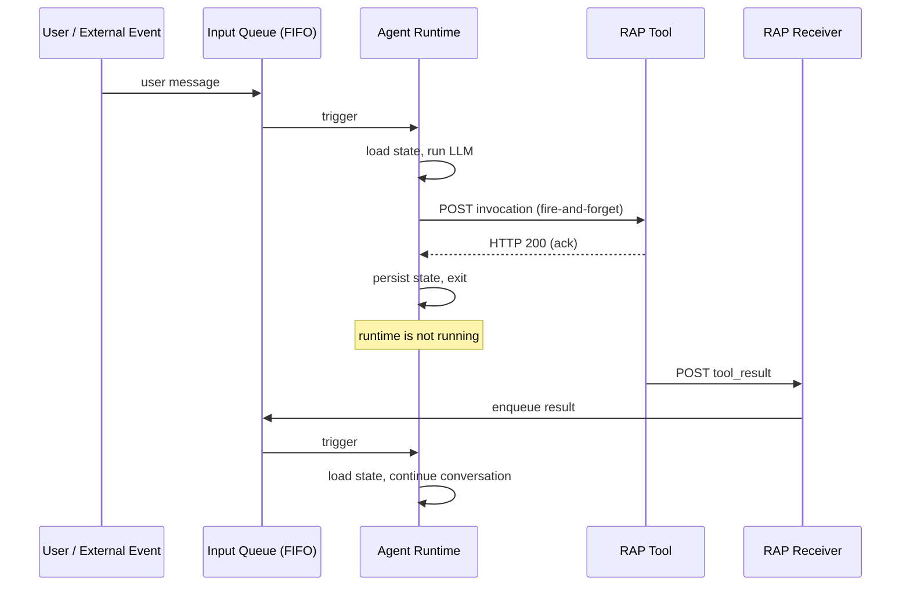

# Architecture

RAP is a message-passing protocol. An agent runtime and a set of independent tools communicate through a single FIFO queue. Every input the runtime processes — user messages, tool results, subscription events — arrives as a message on this queue.

The runtime is stateless and ephemeral. It starts when a message arrives, loads conversation history from durable storage, runs the LLM, dispatches tool calls via HTTP, persists state, and exits. It does not wait for tools to finish.

## Hibernation

This is the defining property of RAP. After dispatching a tool call, the runtime shuts down. The process exits. Zero compute is consumed until the next message arrives.

This isn't a special sleep mode — it's how every tool call works. The runtime fires the request, the tool acknowledges, and the runtime is done. When the tool eventually finishes (milliseconds or days later), it POSTs the result to the RAP receiver, which enqueues it, and the runtime starts fresh.

The same queue handles user messages, tool results, subscription events, and scheduled wake-ups. The runtime doesn't distinguish between them — it loads state and processes whatever's there. An agent waiting for a 3-day CI pipeline costs exactly the same as one that was never created.

This is what lets RAP agents run indefinitely. An agent monitoring GitHub PRs, reacting to Slack messages, and tracking stock prices can stay alive for months. It wakes when something happens, does its work, and shuts down. Cost is proportional to work done, not time elapsed.

## Components

The protocol has four participants:

**Input Queue.** A FIFO queue that serializes all inputs. Messages are grouped by thread ID — different threads process concurrently, messages within a thread are ordered. This is the single rendezvous point for the entire system.

**Agent Runtime.** Loads conversation state, runs LLM completions, dispatches tool calls. Stateless — can be a Lambda, a container, a CLI process. Anything that speaks the RAP message format.

**RAP Tools.** Independent HTTP services. They receive invocations, acknowledge immediately, process asynchronously, and POST results to the RAP receiver. Tools have their own lifecycle, scaling, and failure characteristics.

**RAP Receiver.** An HTTP endpoint that accepts `tool_result`, `subscription_event`, and `oauth` messages from tools and enqueues them on the input queue with the correct thread routing.

## MCP compatibility

MCP servers work as RAP tools through a proxy layer. The proxy spawns the MCP process, forwards JSON-RPC requests, and returns results via the RAP receiver. From the runtime's perspective, an MCP tool looks like any other RAP tool — invoked via HTTP, results arrive asynchronously.

This means you get the full MCP ecosystem (GitHub, Slack, databases, etc.) while gaining RAP's async execution for the tools that need it.
